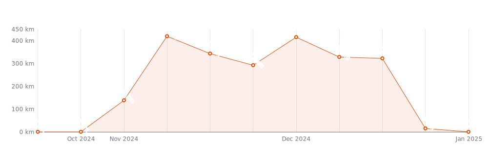
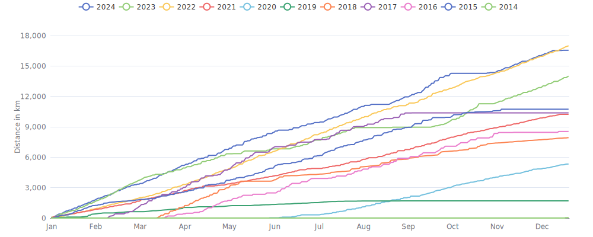

    

Since I began cycling `10 years and 1 month` ago on `29-12-2014`,
I had `1746 cycling days`. 
I recorded a total distance of `90 664 km`
(`2.26` trips around the world 🌍 and
`0.236` trips to the moon 🌕),
an elevation of `594 290 m`
(`67.2` times Mount Everest 🏔)
and a total time of `4mos 2w 1d 18h 41m` 🎉

That's a daily average of `27 km`,
a weekly average of `186 km` and a
monthly average of `802 km` 🐣

I burned `2232011 calories` doing so, that's about `8 267` pizza slices 🍕

---

<kbd><a href="#weekly-distances">Weekly distances</a></kbd> |
<kbd><a href="#activities">Activities</a></kbd> |
<kbd><a href="#monthly-stats">Monthly stats</a></kbd> |
<kbd><a href="#activity-intensity">Activity intensity</a></kbd> |
<kbd><a href="#stats-per-weekday">Stats per weekday</a></kbd> |
<kbd><a href="#daytime-stats">Daytime stats</a></kbd> |
<kbd><a href="#stats-per-bike">Stats per bike</a></kbd> |
<kbd><a href="#best-power-outputs-over-time">Power outputs</a></kbd> |
<kbd><a href="#eddington-chart">Eddington</a></kbd> |
<kbd><a href="#yearly-distances">Yearly distances</a></kbd> |
<kbd><a href="#distance-breakdown">Distance breakdown</a></kbd> |
<kbd><a href="#challenge-consistency">Challenge consistency</a></kbd> |
<kbd><a href="#completed-challenges">Completed challenges</a></kbd>

## Weekly distances

## Activities

<table>
    <tr>
        <th></th>
        <th></th>
        <th align="center"></th>
        <th align="center"></th>
        <th align="center"></th>
        <th align="center"></th>
        <th align="center"></th>
        <th align="center"></th>
    </tr>
            <tr>
            <td>02-05-24</td>
            <td>
                
<a href="https://www.strava.com/activities/11316713671" title="Kcal: 2559 | Gear: Lynskey R500 ">Miles, Smiles, and a Dash ...</a>
            </td>
            <td align="center">92 km</td>
            <td align="center">973 m</td>
            <td align="center">3:10:43</td>
            <td align="center">199 w</td>
            <td align="center">29.1 km/h</td>
            <td align="center">149</td>
        </tr>
            <tr>
            <td>01-05-24</td>
            <td>
                
<a href="https://www.strava.com/activities/11309390682" title="Kcal: 2975 | Gear: Lynskey R500 ">Kennesaw &quot;Mountain&quot; 😇</a>
            </td>
            <td align="center">101 km</td>
            <td align="center">1 295 m</td>
            <td align="center">3:18:08</td>
            <td align="center">227 w</td>
            <td align="center">30.6 km/h</td>
            <td align="center">163</td>
        </tr>
            <tr>
            <td>30-04-24</td>
            <td>
                
<a href="https://www.strava.com/activities/11301765232" title="Kcal: 2096 | Gear: Lynskey R500 ">Way down yonder by the…</a>
            </td>
            <td align="center">69 km</td>
            <td align="center">828 m</td>
            <td align="center">2:08:59</td>
            <td align="center">246 w</td>
            <td align="center">32.1 km/h</td>
            <td align="center">163</td>
        </tr>
            <tr>
            <td>28-04-24</td>
            <td>
                
<a href="https://www.strava.com/activities/11283731563" title="Kcal: 3002 | Gear: Lynskey R500 ">Pressed for time, only rou...</a>
            </td>
            <td align="center">102 km</td>
            <td align="center">1 190 m</td>
            <td align="center">3:16:04</td>
            <td align="center">231 w</td>
            <td align="center">31.2 km/h</td>
            <td align="center">160</td>
        </tr>
            <tr>
            <td>27-04-24</td>
            <td>
                
<a href="https://www.strava.com/activities/11276450654" title="Kcal: 3547 | Gear: Lynskey R500 ">Oh how I&#039;ve missed this ro...</a>
            </td>
            <td align="center">117 km</td>
            <td align="center">1 285 m</td>
            <td align="center">3:47:19</td>
            <td align="center">237 w</td>
            <td align="center">30.8 km/h</td>
            <td align="center">169</td>
        </tr>
        </table>

    
Older activities

    <table>
        <tr>
            <th></th>
            <th></th>
            <th align="center"></th>
            <th align="center"></th>
            <th align="center"></th>
            <th align="center"></th>
            <th align="center"></th>
            <th align="center"></th>
        </tr>
                    <tr>
                <td>26-04-24</td>
                <td>
                    
<a href="https://www.strava.com/activities/11271432300" title="Kcal: 54 | Gear: Lynskey R500 ">It looks goofy as hell, bu...</a>
                </td>
                <td align="center">2 km</td>
                <td align="center">40 m</td>
                <td align="center">5:49</td>
                <td align="center">129 w</td>
                <td align="center">22.6 km/h</td>
                <td align="center">n/a</td>
            </tr>
                    <tr>
                <td>24-04-24</td>
                <td>
                    
<a href="https://www.strava.com/activities/11253845560" title="Kcal: 305 | Gear: Lynskey R500 ">Great start to this trip 🙄...</a>
                </td>
                <td align="center">10 km</td>
                <td align="center">124 m</td>
                <td align="center">21:57</td>
                <td align="center">210 w</td>
                <td align="center">28 km/h</td>
                <td align="center">135</td>
            </tr>
                    <tr>
                <td>21-04-24</td>
                <td>
                    
<a href="https://www.strava.com/activities/11235194836" title="Kcal: 5295 | Gear: Lynskey Pro GR ">Stumptown 100</a>
                </td>
                <td align="center">177 km</td>
                <td align="center">1 388 m</td>
                <td align="center">6:17:38</td>
                <td align="center">210 w</td>
                <td align="center">28.1 km/h</td>
                <td align="center">153</td>
            </tr>
                    <tr>
                <td>19-04-24</td>
                <td>
                                    
<a href="https://www.strava.com/activities/11217310681" title="Kcal: 740 | Gear: Stages ">Sweat, Gears, and Elevatio...</a>
                </td>
                <td align="center">42 km</td>
                <td align="center">331 m</td>
                <td align="center">1:20:08</td>
                <td align="center">161 w</td>
                <td align="center">31.5 km/h</td>
                <td align="center">119</td>
            </tr>
                    <tr>
                <td>18-04-24</td>
                <td>
                                    
<a href="https://www.strava.com/activities/11210242904" title="Kcal: 1111 | Gear: Stages ">Elevation Escapade: 698 Fe...</a>
                </td>
                <td align="center">68 km</td>
                <td align="center">213 m</td>
                <td align="center">2:02:23</td>
                <td align="center">158 w</td>
                <td align="center">33.2 km/h</td>
                <td align="center">123</td>
            </tr>
                    <tr>
                <td>16-04-24</td>
                <td>
                                    
<a href="https://www.strava.com/activities/11195148436" title="Kcal: 834 | Gear: Stages ">Recovery Week - Tempus Fug...</a>
                </td>
                <td align="center">53 km</td>
                <td align="center">82 m</td>
                <td align="center">1:32:43</td>
                <td align="center">157 w</td>
                <td align="center">34.5 km/h</td>
                <td align="center">126</td>
            </tr>
                    <tr>
                <td>14-04-24</td>
                <td>
                    
<a href="https://www.strava.com/activities/11183506090" title="Kcal: 1142 | Gear: Lynskey Pro29 ">Ew, driving to ride a bicy...</a>
                </td>
                <td align="center">26 km</td>
                <td align="center">564 m</td>
                <td align="center">1:43:25</td>
                <td align="center">171 w</td>
                <td align="center">14.9 km/h</td>
                <td align="center">152</td>
            </tr>
                    <tr>
                <td>13-04-24</td>
                <td>
                    
<a href="https://www.strava.com/activities/11175444599" title="Kcal: 4519 | Gear: Lynskey R500 ">First Century Loop of 2024...</a>
                </td>
                <td align="center">162 km</td>
                <td align="center">1 586 m</td>
                <td align="center">5:14:01</td>
                <td align="center">216 w</td>
                <td align="center">30.9 km/h</td>
                <td align="center">155</td>
            </tr>
                    <tr>
                <td>11-04-24</td>
                <td>
                    
<a href="https://www.strava.com/activities/11160169255" title="Kcal: 2333 | Gear: Lynskey R500 ">It&#039;s been a hot minute sin...</a>
                </td>
                <td align="center">82 km</td>
                <td align="center">986 m</td>
                <td align="center">2:39:27</td>
                <td align="center">220 w</td>
                <td align="center">30.7 km/h</td>
                <td align="center">165</td>
            </tr>
                    <tr>
                <td>10-04-24</td>
                <td>
                    
<a href="https://www.strava.com/activities/11152613555" title="Kcal: 2616 | Gear: Lynskey Pro GR ">Do I like playing bikes or...</a>
                </td>
                <td align="center">86 km</td>
                <td align="center">508 m</td>
                <td align="center">2:41:50</td>
                <td align="center">246 w</td>
                <td align="center">32 km/h</td>
                <td align="center">165</td>
            </tr>
                    <tr>
                <td>09-04-24</td>
                <td>
                                    
<a href="https://www.strava.com/activities/11142203931" title="Kcal: 1499 | Gear: Canyon Endurace ">A few days of outside ride...</a>
                </td>
                <td align="center">78 km</td>
                <td align="center">117 m</td>
                <td align="center">2:03:05</td>
                <td align="center">213 w</td>
                <td align="center">37.8 km/h</td>
                <td align="center">146</td>
            </tr>
                    <tr>
                <td>07-04-24</td>
                <td>
                                    
<a href="https://www.strava.com/activities/11128156028" title="Kcal: 1512 | Gear: Stages ">Easy spin watching Paris-R...</a>
                </td>
                <td align="center">90 km</td>
                <td align="center">138 m</td>
                <td align="center">2:32:01</td>
                <td align="center">174 w</td>
                <td align="center">35.7 km/h</td>
                <td align="center">125</td>
            </tr>
                    <tr>
                <td>05-04-24</td>
                <td>
                    
<a href="https://www.strava.com/activities/11112715748" title="Kcal: 2164 | Gear: Canyon Endurace ">Getting out before the win...</a>
                </td>
                <td align="center">71 km</td>
                <td align="center">612 m</td>
                <td align="center">2:23:10</td>
                <td align="center">228 w</td>
                <td align="center">30 km/h</td>
                <td align="center">155</td>
            </tr>
                    <tr>
                <td>04-04-24</td>
                <td>
                                    
<a href="https://www.strava.com/activities/11107608664" title="Kcal: 272 | Gear: Stages ">3of3 Low Rpm/Low Power. Go...</a>
                </td>
                <td align="center">18 km</td>
                <td align="center">28 m</td>
                <td align="center">31:35</td>
                <td align="center">150 w</td>
                <td align="center">33.9 km/h</td>
                <td align="center">121</td>
            </tr>
                    <tr>
                <td>04-04-24</td>
                <td>
                                    
<a href="https://www.strava.com/activities/11107451074" title="Kcal: 286 | Gear: Stages ">Sweat, Gears, and Elevatio...</a>
                </td>
                <td align="center">17 km</td>
                <td align="center">104 m</td>
                <td align="center">30:36</td>
                <td align="center">158 w</td>
                <td align="center">33.2 km/h</td>
                <td align="center">122</td>
            </tr>
                    <tr>
                <td>04-04-24</td>
                <td>
                                    
<a href="https://www.strava.com/activities/11107261697" title="Kcal: 222 | Gear: Stages ">Elevated Escapade: 72 Feet...</a>
                </td>
                <td align="center">14 km</td>
                <td align="center">22 m</td>
                <td align="center">24:59</td>
                <td align="center">155 w</td>
                <td align="center">34.6 km/h</td>
                <td align="center">120</td>
            </tr>
                    <tr>
                <td>02-04-24</td>
                <td>
                    
<a href="https://www.strava.com/activities/11093748712" title="Kcal: 2717 | Gear: Lynskey Pro GR ">Just feels wrong going cou...</a>
                </td>
                <td align="center">83 km</td>
                <td align="center">697 m</td>
                <td align="center">2:54:59</td>
                <td align="center">235 w</td>
                <td align="center">28.6 km/h</td>
                <td align="center">151</td>
            </tr>
                    <tr>
                <td>01-04-24</td>
                <td>
                    
<a href="https://www.strava.com/activities/11086166702" title="Kcal: 2747 | Gear: Lynskey Pro GR ">The wind was not playing n...</a>
                </td>
                <td align="center">87 km</td>
                <td align="center">513 m</td>
                <td align="center">2:51:47</td>
                <td align="center">243 w</td>
                <td align="center">30.4 km/h</td>
                <td align="center">157</td>
            </tr>
                    <tr>
                <td>31-03-24</td>
                <td>
                                    
<a href="https://www.strava.com/activities/11077076663" title="Kcal: 841 | Gear: Stages ">Easy 🚴 - Just watching the...</a>
                </td>
                <td align="center">53 km</td>
                <td align="center">278 m</td>
                <td align="center">1:31:40</td>
                <td align="center">160 w</td>
                <td align="center">34.9 km/h</td>
                <td align="center">123</td>
            </tr>
                    <tr>
                <td>30-03-24</td>
                <td>
                    
<a href="https://www.strava.com/activities/11071872003" title="Kcal: 2674 | Gear: Lynskey Pro GR ">Why are there bugs already...</a>
                </td>
                <td align="center">87 km</td>
                <td align="center">502 m</td>
                <td align="center">2:50:18</td>
                <td align="center">238 w</td>
                <td align="center">30.6 km/h</td>
                <td align="center">156</td>
            </tr>
                    <tr>
                <td>29-03-24</td>
                <td>
                    
<a href="https://www.strava.com/activities/11063102907" title="Kcal: 2161 | Gear: Canyon Grail ">I just wasn&#039;t in the mood ...</a>
                </td>
                <td align="center">67 km</td>
                <td align="center">473 m</td>
                <td align="center">2:26:33</td>
                <td align="center">222 w</td>
                <td align="center">27.6 km/h</td>
                <td align="center">158</td>
            </tr>
                    <tr>
                <td>28-03-24</td>
                <td>
                                    
<a href="https://www.strava.com/activities/11056133764" title="Kcal: 805 | Gear: Stages ">Elevated Squirrel Dash</a>
                </td>
                <td align="center">52 km</td>
                <td align="center">79 m</td>
                <td align="center">1:32:11</td>
                <td align="center">152 w</td>
                <td align="center">33.8 km/h</td>
                <td align="center">122</td>
            </tr>
                    <tr>
                <td>27-03-24</td>
                <td>
                                    
<a href="https://www.strava.com/activities/11049407125" title="Kcal: 1613 | Gear: Stages ">Elevation Escapade: 49 Mil...</a>
                </td>
                <td align="center">79 km</td>
                <td align="center">472 m</td>
                <td align="center">2:02:44</td>
                <td align="center">229 w</td>
                <td align="center">38.7 km/h</td>
                <td align="center">154</td>
            </tr>
                    <tr>
                <td>26-03-24</td>
                <td>
                                    
<a href="https://www.strava.com/activities/11042020834" title="Kcal: 1490 | Gear: Stages ">Elevated Unicorn Glide</a>
                </td>
                <td align="center">79 km</td>
                <td align="center">392 m</td>
                <td align="center">2:02:53</td>
                <td align="center">211 w</td>
                <td align="center">38.6 km/h</td>
                <td align="center">148</td>
            </tr>
                    <tr>
                <td>24-03-24</td>
                <td>
                    
<a href="https://www.strava.com/activities/11030261422" title="Kcal: 2009 | Gear: Canyon Grail ">Rule #9 or something</a>
                </td>
                <td align="center">59 km</td>
                <td align="center">407 m</td>
                <td align="center">2:26:19</td>
                <td align="center">205 w</td>
                <td align="center">24.3 km/h</td>
                <td align="center">148</td>
            </tr>
                    <tr>
                <td>23-03-24</td>
                <td>
                    
<a href="https://www.strava.com/activities/11023678748" title="Kcal: 1933 | Gear: Lynskey R500 ">Frosty Yeti Dash: 44 Miles...</a>
                </td>
                <td align="center">72 km</td>
                <td align="center">623 m</td>
                <td align="center">2:08:14</td>
                <td align="center">228 w</td>
                <td align="center">33.6 km/h</td>
                <td align="center">153</td>
            </tr>
                    <tr>
                <td>22-03-24</td>
                <td>
                    
<a href="https://www.strava.com/activities/11016637553" title="Kcal: 2713 | Gear: Lynskey Pro GR ">Feeling loopy in the valley..</a>
                </td>
                <td align="center">86 km</td>
                <td align="center">502 m</td>
                <td align="center">2:47:27</td>
                <td align="center">246 w</td>
                <td align="center">30.9 km/h</td>
                <td align="center">162</td>
            </tr>
                    <tr>
                <td>20-03-24</td>
                <td>
                                    
<a href="https://www.strava.com/activities/11000470442" title="Kcal: 917 | Gear: Stages ">Elevation Escapade: 20 Mil...</a>
                </td>
                <td align="center">32 km</td>
                <td align="center">687 m</td>
                <td align="center">1:02:42</td>
                <td align="center">255 w</td>
                <td align="center">31 km/h</td>
                <td align="center">157</td>
            </tr>
                    <tr>
                <td>19-03-24</td>
                <td>
                    
<a href="https://www.strava.com/activities/10996131971" title="Kcal: 3857 | Gear: Lynskey Pro GR ">😍😍 One hell of a first day...</a>
                </td>
                <td align="center">123 km</td>
                <td align="center">622 m</td>
                <td align="center">4:23:48</td>
                <td align="center">220 w</td>
                <td align="center">27.9 km/h</td>
                <td align="center">157</td>
            </tr>
                    <tr>
                <td>17-03-24</td>
                <td>
                    
<a href="https://www.strava.com/activities/10982263734" title="Kcal: 3063 | Gear: Lynskey R500 ">Elevation Escapades: 70 Mi...</a>
                </td>
                <td align="center">113 km</td>
                <td align="center">1 010 m</td>
                <td align="center">3:26:56</td>
                <td align="center">223 w</td>
                <td align="center">32.8 km/h</td>
                <td align="center">154</td>
            </tr>
                    <tr>
                <td>16-03-24</td>
                <td>
                    
<a href="https://www.strava.com/activities/10974665534" title="Kcal: 3214 | Gear: Lynskey Pro GR ">Elevation Escapade: 67 Mil...</a>
                </td>
                <td align="center">109 km</td>
                <td align="center">601 m</td>
                <td align="center">3:49:00</td>
                <td align="center">210 w</td>
                <td align="center">28.6 km/h</td>
                <td align="center">149</td>
            </tr>
                    <tr>
                <td>15-03-24</td>
                <td>
                    
<a href="https://www.strava.com/activities/10967092464" title="Kcal: 2390 | Gear: Lynskey R500 ">Frosty Yeti&#039;s Uphill Salsa...</a>
                </td>
                <td align="center">87 km</td>
                <td align="center">340 m</td>
                <td align="center">2:32:23</td>
                <td align="center">238 w</td>
                <td align="center">34.4 km/h</td>
                <td align="center">167</td>
            </tr>
                    <tr>
                <td>13-03-24</td>
                <td>
                                    
<a href="https://www.strava.com/activities/10950998424" title="Kcal: 1045 | Gear: Stages ">Elevated Espresso Express</a>
                </td>
                <td align="center">60 km</td>
                <td align="center">277 m</td>
                <td align="center">1:32:07</td>
                <td align="center">197 w</td>
                <td align="center">38.9 km/h</td>
                <td align="center">140</td>
            </tr>
                    <tr>
                <td>12-03-24</td>
                <td>
                    
<a href="https://www.strava.com/activities/10943972678" title="Kcal: 2122 | Gear: Canyon Endurace ">Deja Vu</a>
                </td>
                <td align="center">72 km</td>
                <td align="center">609 m</td>
                <td align="center">2:17:06</td>
                <td align="center">234 w</td>
                <td align="center">31.3 km/h</td>
                <td align="center">164</td>
            </tr>
                    <tr>
                <td>11-03-24</td>
                <td>
                                    
<a href="https://www.strava.com/activities/10937481259" title="Kcal: 411 | Gear: Stages ">Elevated Espresso Ride: 19...</a>
                </td>
                <td align="center">31 km</td>
                <td align="center">116 m</td>
                <td align="center">1:00:17</td>
                <td align="center">119 w</td>
                <td align="center">30.6 km/h</td>
                <td align="center">122</td>
            </tr>
                    <tr>
                <td>10-03-24</td>
                <td>
                    
<a href="https://www.strava.com/activities/10931595968" title="Kcal: 2173 | Gear: Canyon Endurace ">Frosty Feet, Fiery Calves:...</a>
                </td>
                <td align="center">72 km</td>
                <td align="center">617 m</td>
                <td align="center">2:21:27</td>
                <td align="center">232 w</td>
                <td align="center">30.5 km/h</td>
                <td align="center">164</td>
            </tr>
                    <tr>
                <td>08-03-24</td>
                <td>
                    
<a href="https://www.strava.com/activities/10918897510" title="Kcal: 2163 | Gear: Canyon Endurace ">Sunny-Side Spin: 148 Minut...</a>
                </td>
                <td align="center">77 km</td>
                <td align="center">537 m</td>
                <td align="center">2:28:30</td>
                <td align="center">220 w</td>
                <td align="center">30.9 km/h</td>
                <td align="center">164</td>
            </tr>
                    <tr>
                <td>07-03-24</td>
                <td>
                    
<a href="https://www.strava.com/activities/10912170466" title="Kcal: 2012 | Gear: Canyon Endurace ">Frosty Feet Follies: 41 Mi...</a>
                </td>
                <td align="center">68 km</td>
                <td align="center">276 m</td>
                <td align="center">2:19:58</td>
                <td align="center">216 w</td>
                <td align="center">29 km/h</td>
                <td align="center">162</td>
            </tr>
                    <tr>
                <td>06-03-24</td>
                <td>
                                    
<a href="https://www.strava.com/activities/10903274366" title="Kcal: 1432 | Gear: Stages ">Elevated Banana Split Dash</a>
                </td>
                <td align="center">81 km</td>
                <td align="center">121 m</td>
                <td align="center">2:01:01</td>
                <td align="center">206 w</td>
                <td align="center">40 km/h</td>
                <td align="center">150</td>
            </tr>
                    <tr>
                <td>05-03-24</td>
                <td>
                                    
<a href="https://www.strava.com/activities/10897088017" title="Kcal: 461 | Gear: Stages ">Elevating My Way to the Cl...</a>
                </td>
                <td align="center">18 km</td>
                <td align="center">245 m</td>
                <td align="center">31:45</td>
                <td align="center">253 w</td>
                <td align="center">33.7 km/h</td>
                <td align="center">173</td>
            </tr>
                    <tr>
                <td>05-03-24</td>
                <td>
                                    
<a href="https://www.strava.com/activities/10896794129" title="Kcal: 932 | Gear: Stages ">Elevated Escapade: 20 Mile...</a>
                </td>
                <td align="center">32 km</td>
                <td align="center">697 m</td>
                <td align="center">1:02:22</td>
                <td align="center">261 w</td>
                <td align="center">31.1 km/h</td>
                <td align="center">174</td>
            </tr>
                    <tr>
                <td>05-03-24</td>
                <td>
                                    
<a href="https://www.strava.com/activities/10896269141" title="Kcal: 48 | Gear: Stages ">Zigzagging Weather Whirlwind</a>
                </td>
                <td align="center">2 km</td>
                <td align="center">4 m</td>
                <td align="center">4:03</td>
                <td align="center">216 w</td>
                <td align="center">34.4 km/h</td>
                <td align="center">146</td>
            </tr>
                    <tr>
                <td>03-03-24</td>
                <td>
                                    
<a href="https://www.strava.com/activities/10882371033" title="Kcal: 1008 | Gear: Stages ">Rest week is almost over 🎉...</a>
                </td>
                <td align="center">68 km</td>
                <td align="center">286 m</td>
                <td align="center">2:05:53</td>
                <td align="center">140 w</td>
                <td align="center">32.3 km/h</td>
                <td align="center">128</td>
            </tr>
                    <tr>
                <td>01-03-24</td>
                <td>
                                    
<a href="https://www.strava.com/activities/10869457894" title="Kcal: 710 | Gear: Stages ">I’m enjoying rest week, a ...</a>
                </td>
                <td align="center">49 km</td>
                <td align="center">200 m</td>
                <td align="center">1:32:18</td>
                <td align="center">134 w</td>
                <td align="center">31.7 km/h</td>
                <td align="center">126</td>
            </tr>
                    <tr>
                <td>28-02-24</td>
                <td>
                                    
<a href="https://www.strava.com/activities/10855501092" title="Kcal: 1188 | Gear: Stages ">Elevated Escapade: 46 Mile...</a>
                </td>
                <td align="center">74 km</td>
                <td align="center">281 m</td>
                <td align="center">2:03:37</td>
                <td align="center">167 w</td>
                <td align="center">36 km/h</td>
                <td align="center">131</td>
            </tr>
                    <tr>
                <td>27-02-24</td>
                <td>
                                    
<a href="https://www.strava.com/activities/10848256711" title="Kcal: 1548 | Gear: Stages ">Uphill Salsa Dancing with ...</a>
                </td>
                <td align="center">84 km</td>
                <td align="center">127 m</td>
                <td align="center">2:00:32</td>
                <td align="center">224 w</td>
                <td align="center">41.8 km/h</td>
                <td align="center">155</td>
            </tr>
                    <tr>
                <td>25-02-24</td>
                <td>
                                    
<a href="https://www.strava.com/activities/10835516336" title="Kcal: 745 | Gear: Stages ">Elevation Escapade: 629 Fe...</a>
                </td>
                <td align="center">46 km</td>
                <td align="center">192 m</td>
                <td align="center">1:17:45</td>
                <td align="center">166 w</td>
                <td align="center">35.2 km/h</td>
                <td align="center">120</td>
            </tr>
                    <tr>
                <td>25-02-24</td>
                <td>
                                    
<a href="https://www.strava.com/activities/10834580981" title="Kcal: 28 | Gear: Stages ">Zephyr&#039;s Microscopic Uphil...</a>
                </td>
                <td align="center">1 km</td>
                <td align="center">7 m</td>
                <td align="center">2:35</td>
                <td align="center">185 w</td>
                <td align="center">30.6 km/h</td>
                <td align="center">65</td>
            </tr>
                    <tr>
                <td>24-02-24</td>
                <td>
                                    
<a href="https://www.strava.com/activities/10828181648" title="Kcal: 1724 | Gear: Stages ">Froggy Leap-a-thon: 48 Mil...</a>
                </td>
                <td align="center">78 km</td>
                <td align="center">299 m</td>
                <td align="center">2:00:37</td>
                <td align="center">248 w</td>
                <td align="center">38.6 km/h</td>
                <td align="center">161</td>
            </tr>
                    <tr>
                <td>24-02-24</td>
                <td>
                                    
<a href="https://www.strava.com/activities/10827194576" title="Kcal: 298 | Gear: Stages ">Elevating My Ego: 206 Feet...</a>
                </td>
                <td align="center">16 km</td>
                <td align="center">63 m</td>
                <td align="center">27:55</td>
                <td align="center">186 w</td>
                <td align="center">34.7 km/h</td>
                <td align="center">133</td>
            </tr>
            </table>

## Monthly stats

<table>
    <thead>
    <tr>
        <th>&nbsp;&nbsp;&nbsp;&nbsp;&nbsp;</th>
        <th># of rides</th>
        <th align="center"></th>
        <th align="center"></th>
        <th align="center"></th>
        <th align="center"></th>
    </tr>
    </thead>
    <tbody>
            <tr>
            <td align="center">May 2024</td>
            <td align="center">2</td>
            <td align="center">193 km</td>
            <td align="center">2 268 m</td>
            <td align="center">6h 28m</td>
            <td align="center">4</td>
        </tr>
            <tr>
            <td align="center">April 2024</td>
            <td align="center">21</td>
            <td align="center">1 455 km</td>
            <td align="center">11 356 m</td>
            <td align="center">1d 23h 23m</td>
            <td align="center">20</td>
        </tr>
            <tr>
            <td align="center">March 2024</td>
            <td align="center">26</td>
            <td align="center">1 727 km</td>
            <td align="center">10 973 m</td>
            <td align="center">2d 6h 19m</td>
            <td align="center">20</td>
        </tr>
            <tr>
            <td align="center">February 2024</td>
            <td align="center">28</td>
            <td align="center">1 551 km</td>
            <td align="center">9 882 m</td>
            <td align="center">1d 22h 59m</td>
            <td align="center">10</td>
        </tr>
            <tr>
            <td align="center">January 2024</td>
            <td align="center">34</td>
            <td align="center">1 694 km</td>
            <td align="center">13 585 m</td>
            <td align="center">2d 2h 44m</td>
            <td align="center">13</td>
        </tr>
            <tr>
            <td align="center">December 2023</td>
            <td align="center">24</td>
            <td align="center">1 610 km</td>
            <td align="center">10 112 m</td>
            <td align="center">2d 1h 29m</td>
            <td align="center">9</td>
        </tr>
            <tr>
            <td align="center">November 2023</td>
            <td align="center">22</td>
            <td align="center">1 117 km</td>
            <td align="center">7 807 m</td>
            <td align="center">1d 11h 21m</td>
            <td align="center">9</td>
        </tr>
            <tr>
            <td align="center">October 2023</td>
            <td align="center">23</td>
            <td align="center">2 127 km</td>
            <td align="center">6 243 m</td>
            <td align="center">2d 17h 4m</td>
            <td align="center">16</td>
        </tr>
            <tr>
            <td align="center">September 2023</td>
            <td align="center">7</td>
            <td align="center">147 km</td>
            <td align="center">367 m</td>
            <td align="center">4h 15m</td>
            <td align="center">0</td>
        </tr>
            <tr>
            <td align="center">August 2023</td>
            <td align="center">2</td>
            <td align="center">137 km</td>
            <td align="center">1 510 m</td>
            <td align="center">4h 21m</td>
            <td align="center">4</td>
        </tr>
            <tr>
            <td align="center">July 2023</td>
            <td align="center">21</td>
            <td align="center">1 402 km</td>
            <td align="center">9 785 m</td>
            <td align="center">1d 21h 26m</td>
            <td align="center">9</td>
        </tr>
            <tr>
            <td align="center">June 2023</td>
            <td align="center">13</td>
            <td align="center">695 km</td>
            <td align="center">7 065 m</td>
            <td align="center">1d 2h 57m</td>
            <td align="center">11</td>
        </tr>
            <tr>
            <td align="center">May 2023</td>
            <td align="center">7</td>
            <td align="center">447 km</td>
            <td align="center">5 413 m</td>
            <td align="center">17h 53m</td>
            <td align="center">8</td>
        </tr>
            <tr>
            <td align="center">April 2023</td>
            <td align="center">23</td>
            <td align="center">1 407 km</td>
            <td align="center">12 515 m</td>
            <td align="center">1d 21h 43m</td>
            <td align="center">14</td>
        </tr>
            <tr>
            <td align="center">March 2023</td>
            <td align="center">33</td>
            <td align="center">1 188 km</td>
            <td align="center">9 964 m</td>
            <td align="center">1d 11h 40m</td>
            <td align="center">6</td>
        </tr>
            <tr>
            <td align="center">February 2023</td>
            <td align="center">33</td>
            <td align="center">1 847 km</td>
            <td align="center">11 400 m</td>
            <td align="center">2d 1h 53m</td>
            <td align="center">10</td>
        </tr>
            <tr>
            <td align="center">January 2023</td>
            <td align="center">37</td>
            <td align="center">1 528 km</td>
            <td align="center">12 855 m</td>
            <td align="center">1d 21h 5m</td>
            <td align="center">11</td>
        </tr>
            <tr>
            <td align="center">December 2022</td>
            <td align="center">41</td>
            <td align="center">1 639 km</td>
            <td align="center">9 953 m</td>
            <td align="center">1d 20h 45m</td>
            <td align="center">9</td>
        </tr>
            <tr>
            <td align="center">November 2022</td>
            <td align="center">31</td>
            <td align="center">1 364 km</td>
            <td align="center">10 122 m</td>
            <td align="center">1d 13h 40m</td>
            <td align="center">18</td>
        </tr>
            <tr>
            <td align="center">October 2022</td>
            <td align="center">33</td>
            <td align="center">1 507 km</td>
            <td align="center">13 478 m</td>
            <td align="center">2d 32m</td>
            <td align="center">20</td>
        </tr>
            <tr>
            <td align="center">September 2022</td>
            <td align="center">21</td>
            <td align="center">1 411 km</td>
            <td align="center">13 425 m</td>
            <td align="center">1d 22h 13m</td>
            <td align="center">15</td>
        </tr>
            <tr>
            <td align="center">August 2022</td>
            <td align="center">23</td>
            <td align="center">1 452 km</td>
            <td align="center">13 761 m</td>
            <td align="center">2d 4h 44m</td>
            <td align="center">17</td>
        </tr>
            <tr>
            <td align="center">July 2022</td>
            <td align="center">23</td>
            <td align="center">1 650 km</td>
            <td align="center">8 691 m</td>
            <td align="center">2d 42m</td>
            <td align="center">26</td>
        </tr>
            <tr>
            <td align="center">June 2022</td>
            <td align="center">35</td>
            <td align="center">1 493 km</td>
            <td align="center">13 029 m</td>
            <td align="center">2d 5h 34m</td>
            <td align="center">31</td>
        </tr>
            <tr>
            <td align="center">May 2022</td>
            <td align="center">36</td>
            <td align="center">1 667 km</td>
            <td align="center">15 806 m</td>
            <td align="center">2d 6h 59m</td>
            <td align="center">29</td>
        </tr>
            <tr>
            <td align="center">April 2022</td>
            <td align="center">34</td>
            <td align="center">1 480 km</td>
            <td align="center">14 034 m</td>
            <td align="center">1d 21h 10m</td>
            <td align="center">14</td>
        </tr>
            <tr>
            <td align="center">March 2022</td>
            <td align="center">28</td>
            <td align="center">1 242 km</td>
            <td align="center">12 808 m</td>
            <td align="center">1d 15h 10m</td>
            <td align="center">18</td>
        </tr>
            <tr>
            <td align="center">February 2022</td>
            <td align="center">25</td>
            <td align="center">908 km</td>
            <td align="center">12 577 m</td>
            <td align="center">1d 4h 10m</td>
            <td align="center">10</td>
        </tr>
            <tr>
            <td align="center">January 2022</td>
            <td align="center">20</td>
            <td align="center">857 km</td>
            <td align="center">9 388 m</td>
            <td align="center">1d 3h 16m</td>
            <td align="center">17</td>
        </tr>
            <tr>
            <td align="center">December 2021</td>
            <td align="center">19</td>
            <td align="center">718 km</td>
            <td align="center">10 265 m</td>
            <td align="center">22h 48m</td>
            <td align="center">8</td>
        </tr>
            <tr>
            <td align="center">November 2021</td>
            <td align="center">20</td>
            <td align="center">840 km</td>
            <td align="center">9 639 m</td>
            <td align="center">1d 3h 48m</td>
            <td align="center">13</td>
        </tr>
            <tr>
            <td align="center">October 2021</td>
            <td align="center">22</td>
            <td align="center">1 029 km</td>
            <td align="center">10 925 m</td>
            <td align="center">1d 11h 25m</td>
            <td align="center">12</td>
        </tr>
            <tr>
            <td align="center">September 2021</td>
            <td align="center">18</td>
            <td align="center">1 071 km</td>
            <td align="center">9 321 m</td>
            <td align="center">1d 15h 11m</td>
            <td align="center">13</td>
        </tr>
            <tr>
            <td align="center">August 2021</td>
            <td align="center">16</td>
            <td align="center">914 km</td>
            <td align="center">10 583 m</td>
            <td align="center">1d 13h 52m</td>
            <td align="center">17</td>
        </tr>
            <tr>
            <td align="center">July 2021</td>
            <td align="center">16</td>
            <td align="center">679 km</td>
            <td align="center">3 253 m</td>
            <td align="center">22h 35m</td>
            <td align="center">2</td>
        </tr>
            <tr>
            <td align="center">June 2021</td>
            <td align="center">22</td>
            <td align="center">831 km</td>
            <td align="center">7 010 m</td>
            <td align="center">1d 4h 15m</td>
            <td align="center">0</td>
        </tr>
            <tr>
            <td align="center">May 2021</td>
            <td align="center">23</td>
            <td align="center">770 km</td>
            <td align="center">6 909 m</td>
            <td align="center">22h 35m</td>
            <td align="center">0</td>
        </tr>
            <tr>
            <td align="center">April 2021</td>
            <td align="center">18</td>
            <td align="center">764 km</td>
            <td align="center">7 238 m</td>
            <td align="center">1d 3h 21m</td>
            <td align="center">1</td>
        </tr>
            <tr>
            <td align="center">March 2021</td>
            <td align="center">23</td>
            <td align="center">888 km</td>
            <td align="center">7 867 m</td>
            <td align="center">1d 8h 14m</td>
            <td align="center">1</td>
        </tr>
            <tr>
            <td align="center">February 2021</td>
            <td align="center">20</td>
            <td align="center">705 km</td>
            <td align="center">6 635 m</td>
            <td align="center">21h 23m</td>
            <td align="center">1</td>
        </tr>
            <tr>
            <td align="center">January 2021</td>
            <td align="center">25</td>
            <td align="center">783 km</td>
            <td align="center">8 003 m</td>
            <td align="center">1d 1h 53m</td>
            <td align="center">2</td>
        </tr>
            <tr>
            <td align="center">December 2020</td>
            <td align="center">22</td>
            <td align="center">747 km</td>
            <td align="center">6 054 m</td>
            <td align="center">1d 1h 5m</td>
            <td align="center">1</td>
        </tr>
            <tr>
            <td align="center">November 2020</td>
            <td align="center">24</td>
            <td align="center">845 km</td>
            <td align="center">9 643 m</td>
            <td align="center">1d 3h 50m</td>
            <td align="center">2</td>
        </tr>
            <tr>
            <td align="center">October 2020</td>
            <td align="center">30</td>
            <td align="center">950 km</td>
            <td align="center">14 053 m</td>
            <td align="center">1d 9h 19m</td>
            <td align="center">2</td>
        </tr>
            <tr>
            <td align="center">September 2020</td>
            <td align="center">21</td>
            <td align="center">934 km</td>
            <td align="center">10 695 m</td>
            <td align="center">1d 11h 40m</td>
            <td align="center">3</td>
        </tr>
            <tr>
            <td align="center">August 2020</td>
            <td align="center">26</td>
            <td align="center">895 km</td>
            <td align="center">10 309 m</td>
            <td align="center">1d 15h 33m</td>
            <td align="center">3</td>
        </tr>
            <tr>
            <td align="center">July 2020</td>
            <td align="center">19</td>
            <td align="center">580 km</td>
            <td align="center">8 032 m</td>
            <td align="center">1d 7h 45m</td>
            <td align="center">3</td>
        </tr>
            <tr>
            <td align="center">June 2020</td>
            <td align="center">9</td>
            <td align="center">315 km</td>
            <td align="center">2 903 m</td>
            <td align="center">15h 26m</td>
            <td align="center">0</td>
        </tr>
            <tr>
            <td align="center">September 2019</td>
            <td align="center">1</td>
            <td align="center">7 km</td>
            <td align="center">93 m</td>
            <td align="center">22m</td>
            <td align="center">0</td>
        </tr>
            <tr>
            <td align="center">August 2019</td>
            <td align="center">4</td>
            <td align="center">22 km</td>
            <td align="center">13 m</td>
            <td align="center">57m</td>
            <td align="center">0</td>
        </tr>
            <tr>
            <td align="center">July 2019</td>
            <td align="center">28</td>
            <td align="center">175 km</td>
            <td align="center">111 m</td>
            <td align="center">7h 4m</td>
            <td align="center">0</td>
        </tr>
            <tr>
            <td align="center">June 2019</td>
            <td align="center">26</td>
            <td align="center">164 km</td>
            <td align="center">129 m</td>
            <td align="center">6h 49m</td>
            <td align="center">0</td>
        </tr>
            <tr>
            <td align="center">May 2019</td>
            <td align="center">25</td>
            <td align="center">167 km</td>
            <td align="center">128 m</td>
            <td align="center">6h 32m</td>
            <td align="center">0</td>
        </tr>
            <tr>
            <td align="center">April 2019</td>
            <td align="center">21</td>
            <td align="center">228 km</td>
            <td align="center">353 m</td>
            <td align="center">8h 16m</td>
            <td align="center">0</td>
        </tr>
            <tr>
            <td align="center">March 2019</td>
            <td align="center">43</td>
            <td align="center">282 km</td>
            <td align="center">233 m</td>
            <td align="center">11h 2m</td>
            <td align="center">0</td>
        </tr>
            <tr>
            <td align="center">February 2019</td>
            <td align="center">33</td>
            <td align="center">248 km</td>
            <td align="center">294 m</td>
            <td align="center">9h 49m</td>
            <td align="center">0</td>
        </tr>
            <tr>
            <td align="center">January 2019</td>
            <td align="center">30</td>
            <td align="center">383 km</td>
            <td align="center">720 m</td>
            <td align="center">13h 44m</td>
            <td align="center">1</td>
        </tr>
            <tr>
            <td align="center">December 2018</td>
            <td align="center">49</td>
            <td align="center">314 km</td>
            <td align="center">315 m</td>
            <td align="center">12h 46m</td>
            <td align="center">0</td>
        </tr>
            <tr>
            <td align="center">November 2018</td>
            <td align="center">50</td>
            <td align="center">415 km</td>
            <td align="center">588 m</td>
            <td align="center">15h 38m</td>
            <td align="center">1</td>
        </tr>
            <tr>
            <td align="center">October 2018</td>
            <td align="center">51</td>
            <td align="center">862 km</td>
            <td align="center">2 298 m</td>
            <td align="center">1d 5h 6m</td>
            <td align="center">1</td>
        </tr>
            <tr>
            <td align="center">September 2018</td>
            <td align="center">50</td>
            <td align="center">482 km</td>
            <td align="center">690 m</td>
            <td align="center">17h 13m</td>
            <td align="center">1</td>
        </tr>
            <tr>
            <td align="center">August 2018</td>
            <td align="center">56</td>
            <td align="center">896 km</td>
            <td align="center">2 486 m</td>
            <td align="center">1d 7h 18m</td>
            <td align="center">1</td>
        </tr>
            <tr>
            <td align="center">July 2018</td>
            <td align="center">46</td>
            <td align="center">566 km</td>
            <td align="center">1 268 m</td>
            <td align="center">20h 20m</td>
            <td align="center">2</td>
        </tr>
            <tr>
            <td align="center">June 2018</td>
            <td align="center">29</td>
            <td align="center">633 km</td>
            <td align="center">1 542 m</td>
            <td align="center">21h 31m</td>
            <td align="center">1</td>
        </tr>
            <tr>
            <td align="center">May 2018</td>
            <td align="center">23</td>
            <td align="center">835 km</td>
            <td align="center">1 750 m</td>
            <td align="center">1d 2h 33m</td>
            <td align="center">2</td>
        </tr>
            <tr>
            <td align="center">April 2018</td>
            <td align="center">47</td>
            <td align="center">1 765 km</td>
            <td align="center">4 865 m</td>
            <td align="center">2d 9h 24m</td>
            <td align="center">7</td>
        </tr>
            <tr>
            <td align="center">March 2018</td>
            <td align="center">12</td>
            <td align="center">1 030 km</td>
            <td align="center">2 988 m</td>
            <td align="center">1d 8h 46m</td>
            <td align="center">1</td>
        </tr>
            <tr>
            <td align="center">September 2017</td>
            <td align="center">10</td>
            <td align="center">452 km</td>
            <td align="center">1 842 m</td>
            <td align="center">14h 47m</td>
            <td align="center">1</td>
        </tr>
            <tr>
            <td align="center">August 2017</td>
            <td align="center">15</td>
            <td align="center">1 065 km</td>
            <td align="center">2 900 m</td>
            <td align="center">1d 11h 12m</td>
            <td align="center">2</td>
        </tr>
            <tr>
            <td align="center">July 2017</td>
            <td align="center">16</td>
            <td align="center">1 368 km</td>
            <td align="center">2 707 m</td>
            <td align="center">1d 18h 35m</td>
            <td align="center">3</td>
        </tr>
            <tr>
            <td align="center">June 2017</td>
            <td align="center">16</td>
            <td align="center">998 km</td>
            <td align="center">3 439 m</td>
            <td align="center">1d 8h 17m</td>
            <td align="center">3</td>
        </tr>
            <tr>
            <td align="center">May 2017</td>
            <td align="center">26</td>
            <td align="center">1 950 km</td>
            <td align="center">5 550 m</td>
            <td align="center">2d 16h 7m</td>
            <td align="center">4</td>
        </tr>
            <tr>
            <td align="center">April 2017</td>
            <td align="center">21</td>
            <td align="center">1 662 km</td>
            <td align="center">3 707 m</td>
            <td align="center">2d 7h</td>
            <td align="center">3</td>
        </tr>
            <tr>
            <td align="center">March 2017</td>
            <td align="center">23</td>
            <td align="center">1 823 km</td>
            <td align="center">4 362 m</td>
            <td align="center">2d 13h 46m</td>
            <td align="center">2</td>
        </tr>
            <tr>
            <td align="center">February 2017</td>
            <td align="center">14</td>
            <td align="center">644 km</td>
            <td align="center">1 387 m</td>
            <td align="center">23h 53m</td>
            <td align="center">0</td>
        </tr>
            <tr>
            <td align="center">December 2016</td>
            <td align="center">1</td>
            <td align="center">90 km</td>
            <td align="center">844 m</td>
            <td align="center">3h 19m</td>
            <td align="center">0</td>
        </tr>
            <tr>
            <td align="center">November 2016</td>
            <td align="center">6</td>
            <td align="center">549 km</td>
            <td align="center">3 830 m</td>
            <td align="center">19h 49m</td>
            <td align="center">2</td>
        </tr>
            <tr>
            <td align="center">October 2016</td>
            <td align="center">13</td>
            <td align="center">1 225 km</td>
            <td align="center">12 817 m</td>
            <td align="center">1d 21h</td>
            <td align="center">2</td>
        </tr>
            <tr>
            <td align="center">September 2016</td>
            <td align="center">10</td>
            <td align="center">987 km</td>
            <td align="center">8 812 m</td>
            <td align="center">1d 13h 9m</td>
            <td align="center">1</td>
        </tr>
            <tr>
            <td align="center">August 2016</td>
            <td align="center">14</td>
            <td align="center">1 205 km</td>
            <td align="center">10 500 m</td>
            <td align="center">1d 20h 49m</td>
            <td align="center">1</td>
        </tr>
            <tr>
            <td align="center">July 2016</td>
            <td align="center">11</td>
            <td align="center">652 km</td>
            <td align="center">5 546 m</td>
            <td align="center">1d 32m</td>
            <td align="center">0</td>
        </tr>
            <tr>
            <td align="center">June 2016</td>
            <td align="center">14</td>
            <td align="center">1 253 km</td>
            <td align="center">12 923 m</td>
            <td align="center">2d 23m</td>
            <td align="center">3</td>
        </tr>
            <tr>
            <td align="center">May 2016</td>
            <td align="center">14</td>
            <td align="center">801 km</td>
            <td align="center">9 147 m</td>
            <td align="center">1d 5h 51m</td>
            <td align="center">1</td>
        </tr>
            <tr>
            <td align="center">April 2016</td>
            <td align="center">18</td>
            <td align="center">1 174 km</td>
            <td align="center">13 252 m</td>
            <td align="center">1d 22h 32m</td>
            <td align="center">2</td>
        </tr>
            <tr>
            <td align="center">March 2016</td>
            <td align="center">9</td>
            <td align="center">374 km</td>
            <td align="center">3 516 m</td>
            <td align="center">16h 51m</td>
            <td align="center">0</td>
        </tr>
            <tr>
            <td align="center">November 2015</td>
            <td align="center">28</td>
            <td align="center">256 km</td>
            <td align="center">513 m</td>
            <td align="center">9h 31m</td>
            <td align="center">1</td>
        </tr>
            <tr>
            <td align="center">October 2015</td>
            <td align="center">35</td>
            <td align="center">569 km</td>
            <td align="center">1 485 m</td>
            <td align="center">19h 18m</td>
            <td align="center">0</td>
        </tr>
            <tr>
            <td align="center">September 2015</td>
            <td align="center">16</td>
            <td align="center">1 175 km</td>
            <td align="center">2 650 m</td>
            <td align="center">1d 14h 36m</td>
            <td align="center">1</td>
        </tr>
            <tr>
            <td align="center">August 2015</td>
            <td align="center">26</td>
            <td align="center">1 488 km</td>
            <td align="center">3 070 m</td>
            <td align="center">2d 42m</td>
            <td align="center">3</td>
        </tr>
            <tr>
            <td align="center">July 2015</td>
            <td align="center">22</td>
            <td align="center">1 400 km</td>
            <td align="center">1 829 m</td>
            <td align="center">1d 21h 40m</td>
            <td align="center">2</td>
        </tr>
            <tr>
            <td align="center">June 2015</td>
            <td align="center">23</td>
            <td align="center">1 052 km</td>
            <td align="center">1 373 m</td>
            <td align="center">1d 10h 54m</td>
            <td align="center">2</td>
        </tr>
            <tr>
            <td align="center">May 2015</td>
            <td align="center">20</td>
            <td align="center">1 327 km</td>
            <td align="center">2 449 m</td>
            <td align="center">1d 22h 37m</td>
            <td align="center">3</td>
        </tr>
            <tr>
            <td align="center">April 2015</td>
            <td align="center">16</td>
            <td align="center">944 km</td>
            <td align="center">2 082 m</td>
            <td align="center">1d 9h 7m</td>
            <td align="center">1</td>
        </tr>
            <tr>
            <td align="center">March 2015</td>
            <td align="center">26</td>
            <td align="center">727 km</td>
            <td align="center">535 m</td>
            <td align="center">1d 4h 14m</td>
            <td align="center">2</td>
        </tr>
            <tr>
            <td align="center">February 2015</td>
            <td align="center">38</td>
            <td align="center">485 km</td>
            <td align="center">206 m</td>
            <td align="center">20h 45m</td>
            <td align="center">1</td>
        </tr>
            <tr>
            <td align="center">January 2015</td>
            <td align="center">30</td>
            <td align="center">1 227 km</td>
            <td align="center">612 m</td>
            <td align="center">2d 4h 31m</td>
            <td align="center">1</td>
        </tr>
            <tr>
            <td align="center">December 2014</td>
            <td align="center">6</td>
            <td align="center">68 km</td>
            <td align="center">32 m</td>
            <td align="center">3h 6m</td>
            <td align="center">0</td>
        </tr>
        <tr>
        <td align="center"><b>Virtual/Indoor</b></td>
        <td align="center"><b>626</td>
        <td align="center"><b>23 531 km</b></td>
        <td align="center"><b>219 044 m</b></td>
        <td align="center"><b>1mo 11h 15m</b></td>
        <td align="center"></td>
    </tr>
    <tr>
        <td align="center"><b>Outside</b></td>
        <td align="center"><b>1634</td>
        <td align="center"><b>67 133 km</b></td>
        <td align="center"><b>375 247 m</b></td>
        <td align="center"><b>3mos 2w 1d 7h 26m</b></td>
        <td align="center"></td>
    </tr>
    <tr>
        <td align="center"><b>Total</b></td>
        <td align="center"><b>2260</td>
        <td align="center"><b>90 664 km</b></td>
        <td align="center"><b>594 290 m</b></td>
        <td align="center"><b>4mos 2w 1d 18h 41m</b></td>
        <td align="center"></td>
    </tr>
    </tbody>
</table>

## Activity intensity

## Stats per weekday

<table>
    <thead>
    <tr>
        <th></th>
        <th># of rides</th>
        <th align="center"></th>
        <th align="center"></th>
        <th align="center"></th>
        <th align="center"></th>
    </tr>
    </thead>
    <tbody>
            <tr>
            <td align="center">Monday</td>
            <td align="center">286</td>
            <td align="center">
                                    39 km avg /
                    11 092 km total
                            </td>
            <td align="center">75 071 m</td>
            <td align="center">2w 1d 19h 58m</td>
            <td align="center">29.2 km/h</td>
        </tr>
            <tr>
            <td align="center">Tuesday</td>
            <td align="center">305</td>
            <td align="center">
                                    39 km avg /
                    11 965 km total
                            </td>
            <td align="center">78 909 m</td>
            <td align="center">2w 2d 12h 17m</td>
            <td align="center">30.2 km/h</td>
        </tr>
            <tr>
            <td align="center">Wednesday</td>
            <td align="center">321</td>
            <td align="center">
                                    38 km avg /
                    12 201 km total
                            </td>
            <td align="center">82 147 m</td>
            <td align="center">2w 3d 6h 52m</td>
            <td align="center">29.4 km/h</td>
        </tr>
            <tr>
            <td align="center">Thursday</td>
            <td align="center">333</td>
            <td align="center">
                                    35 km avg /
                    11 496 km total
                            </td>
            <td align="center">77 115 m</td>
            <td align="center">2w 1d 19h 40m</td>
            <td align="center">30.3 km/h</td>
        </tr>
            <tr>
            <td align="center">Friday</td>
            <td align="center">332</td>
            <td align="center">
                                    34 km avg /
                    11 149 km total
                            </td>
            <td align="center">79 935 m</td>
            <td align="center">2w 2d 55m</td>
            <td align="center">29.0 km/h</td>
        </tr>
            <tr>
            <td align="center">Saturday</td>
            <td align="center">329</td>
            <td align="center">
                                    47 km avg /
                    15 601 km total
                            </td>
            <td align="center">94 601 m</td>
            <td align="center">3w 22h 57m</td>
            <td align="center">29.6 km/h</td>
        </tr>
            <tr>
            <td align="center">Sunday</td>
            <td align="center">354</td>
            <td align="center">
                                    48 km avg /
                    17 160 km total
                            </td>
            <td align="center">106 513 m</td>
            <td align="center">3w 3d 7h 59m</td>
            <td align="center">29.4 km/h</td>
        </tr>
        </tbody>
</table>

## Daytime stats

<table>
    <thead>
    <tr>
        <th></th>
        <th># of rides</th>
        <th align="center"></th>
        <th align="center"></th>
        <th align="center"></th>
        <th align="center"></th>
    </tr>
    </thead>
    <tbody>
            <tr>
            <td align="center">Morning (6h - 12h)</td>
            <td align="center">1204</td>
            <td align="center">
                                    54 km avg /
                    64 666 km total
                            </td>
            <td align="center">422 296 m</td>
            <td align="center">3mos 6d 10h 49m</td>
            <td align="center">29.8 km/h</td>
        </tr>
            <tr>
            <td align="center">Afternoon (12h - 17h)</td>
            <td align="center">640</td>
            <td align="center">
                                    27 km avg /
                    17 285 km total
                            </td>
            <td align="center">136 702 m</td>
            <td align="center">3w 3d 16h 2m</td>
            <td align="center">29.2 km/h</td>
        </tr>
            <tr>
            <td align="center">Evening (17h - 23h)</td>
            <td align="center">322</td>
            <td align="center">
                                    20 km avg /
                    6 303 km total
                            </td>
            <td align="center">31 489 m</td>
            <td align="center">1w 2d 7h 15m</td>
            <td align="center">28.2 km/h</td>
        </tr>
            <tr>
            <td align="center">Night (23h - 6h)</td>
            <td align="center">94</td>
            <td align="center">
                                    26 km avg /
                    2 410 km total
                            </td>
            <td align="center">3 804 m</td>
            <td align="center">3d 8h 34m</td>
            <td align="center">29.9 km/h</td>
        </tr>
        </tbody>
</table>

## Stats per bike

<table>
    <thead>
    <tr>
        <th></th>
        <th># of rides</th>
        <th align="center"></th>
        <th align="center"></th>
        <th align="center"></th>
        <th align="center"></th>
    </tr>
    </thead>
    <tbody>
            <tr>
            <td align="center">Fuji Roubaix 3 ☠️</td>
            <td align="center">418</td>
            <td align="center">
                                    76 km avg /
                    31 731 km total
                            </td>
            <td align="center">133 890 m</td>
            <td align="center">1mo 2w 2d 21h 14m</td>
            <td align="center">29.5 km/h</td>
        </tr>
            <tr>
            <td align="center">Canyon Endurace</td>
            <td align="center">455</td>
            <td align="center">
                                    44 km avg /
                    20 189 km total
                            </td>
            <td align="center">166 494 m</td>
            <td align="center">3w 5d 8h 15m</td>
            <td align="center">31.9 km/h</td>
        </tr>
            <tr>
            <td align="center">Stages</td>
            <td align="center">172</td>
            <td align="center">
                                    48 km avg /
                    8 184 km total
                            </td>
            <td align="center">55 444 m</td>
            <td align="center">1w 2d 13h 23m</td>
            <td align="center">35.7 km/h</td>
        </tr>
            <tr>
            <td align="center">Lynskey R500</td>
            <td align="center">91</td>
            <td align="center">
                                    81 km avg /
                    7 335 km total
                            </td>
            <td align="center">48 778 m</td>
            <td align="center">1w 2d 10h 42m</td>
            <td align="center">32.4 km/h</td>
        </tr>
            <tr>
            <td align="center">Trainer ☠️</td>
            <td align="center">191</td>
            <td align="center">
                                    33 km avg /
                    6 209 km total
                            </td>
            <td align="center">75 141 m</td>
            <td align="center">1w 16h 40m</td>
            <td align="center">33.6 km/h</td>
        </tr>
            <tr>
            <td align="center">Schwinn Volare 1300 ☠️</td>
            <td align="center">715</td>
            <td align="center">
                                    8 km avg /
                    5 883 km total
                            </td>
            <td align="center">5 347 m</td>
            <td align="center">1w 3d 4h 31m</td>
            <td align="center">24.1 km/h</td>
        </tr>
            <tr>
            <td align="center">Canyon Grail</td>
            <td align="center">91</td>
            <td align="center">
                                    64 km avg /
                    5 829 km total
                            </td>
            <td align="center">50 212 m</td>
            <td align="center">1w 2d 4h 15m</td>
            <td align="center">26.5 km/h</td>
        </tr>
            <tr>
            <td align="center">Vitus Rapide</td>
            <td align="center">64</td>
            <td align="center">
                                    35 km avg /
                    2 244 km total
                            </td>
            <td align="center">31 577 m</td>
            <td align="center">5d 2h 29m</td>
            <td align="center">18.3 km/h</td>
        </tr>
            <tr>
            <td align="center">Lynskey Pro GR</td>
            <td align="center">20</td>
            <td align="center">
                                    93 km avg /
                    1 863 km total
                            </td>
            <td align="center">15 483 m</td>
            <td align="center">2d 20h 55m</td>
            <td align="center">27.0 km/h</td>
        </tr>
            <tr>
            <td align="center">Trek ☠️</td>
            <td align="center">14</td>
            <td align="center">
                                    40 km avg /
                    557 km total
                            </td>
            <td align="center">5 373 m</td>
            <td align="center">23h 54m</td>
            <td align="center">23.3 km/h</td>
        </tr>
            <tr>
            <td align="center">Trainer ☠️</td>
            <td align="center">5</td>
            <td align="center">
                                    35 km avg /
                    177 km total
                            </td>
            <td align="center">0 m</td>
            <td align="center">5h 42m</td>
            <td align="center">31.0 km/h</td>
        </tr>
            <tr>
            <td align="center">Lynskey Pro29</td>
            <td align="center">8</td>
            <td align="center">
                                    19 km avg /
                    149 km total
                            </td>
            <td align="center">3 779 m</td>
            <td align="center">11h 1m</td>
            <td align="center">13.5 km/h</td>
        </tr>
            <tr>
            <td align="center">POS ☠️</td>
            <td align="center">3</td>
            <td align="center">
                                    42 km avg /
                    126 km total
                            </td>
            <td align="center">814 m</td>
            <td align="center">5h 55m</td>
            <td align="center">21.3 km/h</td>
        </tr>
            <tr>
            <td align="center">Bigfoot</td>
            <td align="center">5</td>
            <td align="center">
                                    23 km avg /
                    113 km total
                            </td>
            <td align="center">1 812 m</td>
            <td align="center">8h 47m</td>
            <td align="center">12.8 km/h</td>
        </tr>
            <tr>
            <td align="center">Projekt ☠️</td>
            <td align="center">7</td>
            <td align="center">
                                    14 km avg /
                    96 km total
                            </td>
            <td align="center">135 m</td>
            <td align="center">4h 16m</td>
            <td align="center">22.4 km/h</td>
        </tr>
            <tr>
            <td align="center">Other ☠️</td>
            <td align="center">1</td>
            <td align="center">
                                    12 km avg /
                    12 km total
                            </td>
            <td align="center">13 m</td>
            <td align="center">34m</td>
            <td align="center">20.8 km/h</td>
        </tr>
        </tbody>
</table>

## Best power outputs over time

<table>
    <tr>
        <th align="center"></th>
        <th align="center" colspan="2"></th>
        <th></th>
    </tr>
                                <tr>
            <td align="center">5 s</td>
            <td align="center">1392 w</td>
            <td align="center">18.05 w/kg</td>
            <td>
                                
<a href="https://www.strava.com/activities/8691783271" title="Kcal: 891 | Gear: None ">2hr Below Recovery in Innsbruck</a>
            </td>
        </tr>
                            <tr>
            <td align="center">10 s</td>
            <td align="center">1102 w</td>
            <td align="center">14.29 w/kg</td>
            <td>
                
<a href="https://www.strava.com/activities/387361168" title="Kcal: 1679 | Gear: None ">Work then ride.. Why not.. More ops tomorrow, doh..</a>
            </td>
        </tr>
                            <tr>
            <td align="center">30 s</td>
            <td align="center">858 w</td>
            <td align="center">11.13 w/kg</td>
            <td>
                
<a href="https://www.strava.com/activities/1567573906" title="Kcal: 3529 | Gear: None ">NWCC Zube long</a>
            </td>
        </tr>
                            <tr>
            <td align="center">1 m</td>
            <td align="center">578 w</td>
            <td align="center">7.5 w/kg</td>
            <td>
                
<a href="https://www.strava.com/activities/7473317097" title="Kcal: 2412 | Gear: None ">TGIF VCC &amp; Bonus miles 😎</a>
            </td>
        </tr>
                            <tr>
            <td align="center">5 m</td>
            <td align="center">346 w</td>
            <td align="center">4.49 w/kg</td>
            <td>
                
<a href="https://www.strava.com/activities/7922641156" title="Kcal: 1248 | Gear: None ">Short ride intown</a>
            </td>
        </tr>
                            <tr>
            <td align="center">8 m</td>
            <td align="center">321 w</td>
            <td align="center">4.16 w/kg</td>
            <td>
                
<a href="https://www.strava.com/activities/9569508058" title="Kcal: 3134 | Gear: None ">Kennesaw mountain.. my goodbye Atlanta route 😭</a>
            </td>
        </tr>
                            <tr>
            <td align="center">20 m</td>
            <td align="center">306 w</td>
            <td align="center">3.97 w/kg</td>
            <td>
                
<a href="https://www.strava.com/activities/410166034" title="Kcal: 3283 | Gear: None ">That north wind tho</a>
            </td>
        </tr>
                            <tr>
            <td align="center">1 h</td>
            <td align="center">298 w</td>
            <td align="center">3.86 w/kg</td>
            <td>
                
<a href="https://www.strava.com/activities/410166034" title="Kcal: 3283 | Gear: None ">That north wind tho</a>
            </td>
        </tr>
    </table>

## Eddington chart

> The Eddington number in the context of cycling is defined as the maximum number E such that the cyclist has cycled at least E km on at least E days.
>
> For example, an Eddington number of 70 would imply that the cyclist has cycled at least 70 km in a day on at least 70 occasions.
> Achieving a high Eddington number is difficult, since moving from, say, 70 to 75 will (probably) require more than five new long-distance rides, since any rides shorter than 75 km will no longer be included in the reckoning.

<table align="center">
    <tr>
        <th align="center">Eddington</th>
            <th align="center">115 km</th>
            <th align="center">116 km</th>
            <th align="center">117 km</th>
            <th align="center">118 km</th>
            <th align="center">119 km</th>
            <th align="center">120 km</th>
            <th align="center">121 km</th>
            <th align="center">122 km</th>
            <th align="center">123 km</th>
            <th align="center">124 km</th>
            <th align="center">125 km</th>
        </tr>
    <tr>
        <td align="center">Days needed</td>
            <td align="center">4</td>
            <td align="center">6</td>
            <td align="center">13</td>
            <td align="center">14</td>
            <td align="center">18</td>
            <td align="center">21</td>
            <td align="center">23</td>
            <td align="center">26</td>
            <td align="center">29</td>
            <td align="center">32</td>
            <td align="center">36</td>
        </tr>
</table>

## Yearly distances

<table>
    <thead>
    <tr>
        <th>Year</th>
        <th align="center"></th>
        <th>Δ prev year</th>
        <th align="center"></th>
        <th align="center"></th>
    </tr>
    </thead>
    <tbody>
            <tr>
            <td align="center">2024</td>
            <td align="center">6 620 km</td>
            <td align="center">
                                    -7 034 km
                            </td>
            <td align="center">48 064 m</td>
            <td align="center">1w 1d 13h 56m</td>
        </tr>
            <tr>
            <td align="center">2023</td>
            <td align="center">13 653 km</td>
            <td align="center">
                                    -3 017 km
                            </td>
            <td align="center">95 037 m</td>
            <td align="center">2w 3d 17h 12m</td>
        </tr>
            <tr>
            <td align="center">2022</td>
            <td align="center">16 670 km</td>
            <td align="center">
                                    6 679 km
                            </td>
            <td align="center">147 072 m</td>
            <td align="center">3w 23h 1m</td>
        </tr>
            <tr>
            <td align="center">2021</td>
            <td align="center">9 991 km</td>
            <td align="center">
                                    4 724 km
                            </td>
            <td align="center">97 648 m</td>
            <td align="center">2w 7h 26m</td>
        </tr>
            <tr>
            <td align="center">2020</td>
            <td align="center">5 267 km</td>
            <td align="center">
                                    3 593 km
                            </td>
            <td align="center">61 689 m</td>
            <td align="center">1w 1d 16h 41m</td>
        </tr>
            <tr>
            <td align="center">2019</td>
            <td align="center">1 674 km</td>
            <td align="center">
                                    -6 123 km
                            </td>
            <td align="center">2 074 m</td>
            <td align="center">2d 16h 41m</td>
        </tr>
            <tr>
            <td align="center">2018</td>
            <td align="center">7 797 km</td>
            <td align="center">
                                    -2 165 km
                            </td>
            <td align="center">18 790 m</td>
            <td align="center">1w 4d 39m</td>
        </tr>
            <tr>
            <td align="center">2017</td>
            <td align="center">9 962 km</td>
            <td align="center">
                                    1 651 km
                            </td>
            <td align="center">25 894 m</td>
            <td align="center">1w 6d 17h 40m</td>
        </tr>
            <tr>
            <td align="center">2016</td>
            <td align="center">8 311 km</td>
            <td align="center">
                                    -2 340 km
                            </td>
            <td align="center">81 187 m</td>
            <td align="center">1w 6d 4h 18m</td>
        </tr>
            <tr>
            <td align="center">2015</td>
            <td align="center">10 650 km</td>
            <td align="center">
                                    10 582 km
                            </td>
            <td align="center">16 804 m</td>
            <td align="center">2w 1d 17h 58m</td>
        </tr>
            <tr>
            <td align="center">2014</td>
            <td align="center">68 km</td>
            <td align="center">
                            </td>
            <td align="center">32 m</td>
            <td align="center">3h 6m</td>
        </tr>
        </tbody>
</table>

## Distance breakdown

<table>
    <thead>
    <tr>
        <th></th>
        <th># of rides</th>
        <th align="center"></th>
        <th align="center"></th>
        <th align="center"></th>
        <th align="center"></th>
    </tr>
    </thead>
    <tbody>
            <tr>
            <td align="center">0 - 20 km</td>
            <td align="center">946</td>
            <td align="center">
                                     7 km avg /
                     6 826 km total
                            </td>
            <td align="center">22 794 m</td>
            <td align="center">1w 4d 6h 20m</td>
            <td align="center">25.2 km/h</td>
        </tr>
            <tr>
            <td align="center">20 - 40 km</td>
            <td align="center">388</td>
            <td align="center">
                                     32 km avg /
                     12 510 km total
                            </td>
            <td align="center">133 232 m</td>
            <td align="center">2w 3d 19h 33m</td>
            <td align="center">29.3 km/h</td>
        </tr>
            <tr>
            <td align="center">40 - 60 km</td>
            <td align="center">327</td>
            <td align="center">
                                     48 km avg /
                     15 743 km total
                            </td>
            <td align="center">116 754 m</td>
            <td align="center">3w 19h 3m</td>
            <td align="center">30.1 km/h</td>
        </tr>
            <tr>
            <td align="center">60 - 80 km</td>
            <td align="center">241</td>
            <td align="center">
                                     70 km avg /
                     16 913 km total
                            </td>
            <td align="center">110 512 m</td>
            <td align="center">3w 2d 9h 56m</td>
            <td align="center">30.1 km/h</td>
        </tr>
            <tr>
            <td align="center">80 - 100 km</td>
            <td align="center">167</td>
            <td align="center">
                                     88 km avg /
                     14 758 km total
                            </td>
            <td align="center">98 475 m</td>
            <td align="center">2w 6d 11h 32m</td>
            <td align="center">30.0 km/h</td>
        </tr>
            <tr>
            <td align="center">100 - 120 km</td>
            <td align="center">98</td>
            <td align="center">
                                     108 km avg /
                     10 560 km total
                            </td>
            <td align="center">60 901 m</td>
            <td align="center">2w 16h 8m</td>
            <td align="center">30.0 km/h</td>
        </tr>
            <tr>
            <td align="center">120 - 140 km</td>
            <td align="center">51</td>
            <td align="center">
                                     130 km avg /
                     6 654 km total
                            </td>
            <td align="center">22 875 m</td>
            <td align="center">1w 2d 5h 5m</td>
            <td align="center">30.1 km/h</td>
        </tr>
            <tr>
            <td align="center">140 - 160 km</td>
            <td align="center">14</td>
            <td align="center">
                                     149 km avg /
                     2 091 km total
                            </td>
            <td align="center">8 886 m</td>
            <td align="center">2d 20h 51m</td>
            <td align="center">30.4 km/h</td>
        </tr>
            <tr>
            <td align="center">160 - 180 km</td>
            <td align="center">23</td>
            <td align="center">
                                     167 km avg /
                     3 851 km total
                            </td>
            <td align="center">17 297 m</td>
            <td align="center">5d 5h 6m</td>
            <td align="center">30.8 km/h</td>
        </tr>
            <tr>
            <td align="center">180 - 200 km</td>
            <td align="center">3</td>
            <td align="center">
                                     184 km avg /
                     553 km total
                            </td>
            <td align="center">2 235 m</td>
            <td align="center">17h 59m</td>
            <td align="center">30.8 km/h</td>
        </tr>
            <tr>
            <td align="center">200 - 220 km</td>
            <td align="center">1</td>
            <td align="center">
                                     204 km avg /
                     204 km total
                            </td>
            <td align="center">329 m</td>
            <td align="center">7h 3m</td>
            <td align="center">28.9 km/h</td>
        </tr>
        </tbody>
</table>

## Challenge consistency

<table>
    <thead>
    <tr>
        <th></th>
                <th align="center">May 2024</th>
                <th align="center">Apr 2024</th>
                <th align="center">Mar 2024</th>
                <th align="center">Feb 2024</th>
                <th align="center">Jan 2024</th>
                <th align="center">Dec 2023</th>
                <th align="center">Nov 2023</th>
                <th align="center">Oct 2023</th>
                <th align="center">Sep 2023</th>
                <th align="center">Aug 2023</th>
                <th align="center">Jul 2023</th>
                <th align="center">Jun 2023</th>
                <th align="center">May 2023</th>
                <th align="center">Apr 2023</th>
                <th align="center">Mar 2023</th>
                <th align="center">Feb 2023</th>
                <th align="center">Jan 2023</th>
                <th align="center">Dec 2022</th>
                <th align="center">Nov 2022</th>
                <th align="center">Oct 2022</th>
                <th align="center">Sep 2022</th>
                <th align="center">Aug 2022</th>
                <th align="center">Jul 2022</th>
                <th align="center">Jun 2022</th>
                <th align="center">May 2022</th>
                <th align="center">Apr 2022</th>
                <th align="center">Mar 2022</th>
                <th align="center">Feb 2022</th>
                <th align="center">Jan 2022</th>
                <th align="center">Dec 2021</th>
                <th align="center">Nov 2021</th>
                <th align="center">Oct 2021</th>
                <th align="center">Sep 2021</th>
                <th align="center">Aug 2021</th>
                <th align="center">Jul 2021</th>
                <th align="center">Jun 2021</th>
                <th align="center">May 2021</th>
                <th align="center">Apr 2021</th>
                <th align="center">Mar 2021</th>
                <th align="center">Feb 2021</th>
                <th align="center">Jan 2021</th>
                <th align="center">Dec 2020</th>
                <th align="center">Nov 2020</th>
                <th align="center">Oct 2020</th>
                <th align="center">Sep 2020</th>
                <th align="center">Aug 2020</th>
                <th align="center">Jul 2020</th>
                <th align="center">Jun 2020</th>
                <th align="center">May 2020</th>
                <th align="center">Apr 2020</th>
                <th align="center">Mar 2020</th>
                <th align="center">Feb 2020</th>
                <th align="center">Jan 2020</th>
                <th align="center">Dec 2019</th>
                <th align="center">Nov 2019</th>
                <th align="center">Oct 2019</th>
                <th align="center">Sep 2019</th>
                <th align="center">Aug 2019</th>
                <th align="center">Jul 2019</th>
                <th align="center">Jun 2019</th>
                <th align="center">May 2019</th>
                <th align="center">Apr 2019</th>
                <th align="center">Mar 2019</th>
                <th align="center">Feb 2019</th>
                <th align="center">Jan 2019</th>
                <th align="center">Dec 2018</th>
                <th align="center">Nov 2018</th>
                <th align="center">Oct 2018</th>
                <th align="center">Sep 2018</th>
                <th align="center">Aug 2018</th>
                <th align="center">Jul 2018</th>
                <th align="center">Jun 2018</th>
                <th align="center">May 2018</th>
                <th align="center">Apr 2018</th>
                <th align="center">Mar 2018</th>
                <th align="center">Feb 2018</th>
                <th align="center">Jan 2018</th>
                <th align="center">Dec 2017</th>
                <th align="center">Nov 2017</th>
                <th align="center">Oct 2017</th>
                <th align="center">Sep 2017</th>
                <th align="center">Aug 2017</th>
                <th align="center">Jul 2017</th>
                <th align="center">Jun 2017</th>
                <th align="center">May 2017</th>
                <th align="center">Apr 2017</th>
                <th align="center">Mar 2017</th>
                <th align="center">Feb 2017</th>
                <th align="center">Jan 2017</th>
                <th align="center">Dec 2016</th>
                <th align="center">Nov 2016</th>
                <th align="center">Oct 2016</th>
                <th align="center">Sep 2016</th>
                <th align="center">Aug 2016</th>
                <th align="center">Jul 2016</th>
                <th align="center">Jun 2016</th>
                <th align="center">May 2016</th>
                <th align="center">Apr 2016</th>
                <th align="center">Mar 2016</th>
                <th align="center">Feb 2016</th>
                <th align="center">Jan 2016</th>
                <th align="center">Dec 2015</th>
                <th align="center">Nov 2015</th>
                <th align="center">Oct 2015</th>
                <th align="center">Sep 2015</th>
                <th align="center">Aug 2015</th>
                <th align="center">Jul 2015</th>
                <th align="center">Jun 2015</th>
                <th align="center">May 2015</th>
                <th align="center">Apr 2015</th>
                <th align="center">Mar 2015</th>
                <th align="center">Feb 2015</th>
                <th align="center">Jan 2015</th>
                <th align="center">Dec 2014</th>
            </tr>
    </thead>
    <tbody>
            <tr>
            <td align="center">Ride a total of 200km</td>
                        <td align="center">
                            </td>
                        <td align="center">
                                    
                            </td>
                        <td align="center">
                                    
                            </td>
                        <td align="center">
                                    
                            </td>
                        <td align="center">
                                    
                            </td>
                        <td align="center">
                                    
                            </td>
                        <td align="center">
                                    
                            </td>
                        <td align="center">
                                    
                            </td>
                        <td align="center">
                            </td>
                        <td align="center">
                            </td>
                        <td align="center">
                                    
                            </td>
                        <td align="center">
                                    
                            </td>
                        <td align="center">
                                    
                            </td>
                        <td align="center">
                                    
                            </td>
                        <td align="center">
                                    
                            </td>
                        <td align="center">
                                    
                            </td>
                        <td align="center">
                                    
                            </td>
                        <td align="center">
                                    
                            </td>
                        <td align="center">
                                    
                            </td>
                        <td align="center">
                                    
                            </td>
                        <td align="center">
                                    
                            </td>
                        <td align="center">
                                    
                            </td>
                        <td align="center">
                                    
                            </td>
                        <td align="center">
                                    
                            </td>
                        <td align="center">
                                    
                            </td>
                        <td align="center">
                                    
                            </td>
                        <td align="center">
                                    
                            </td>
                        <td align="center">
                                    
                            </td>
                        <td align="center">
                                    
                            </td>
                        <td align="center">
                                    
                            </td>
                        <td align="center">
                                    
                            </td>
                        <td align="center">
                                    
                            </td>
                        <td align="center">
                                    
                            </td>
                        <td align="center">
                                    
                            </td>
                        <td align="center">
                                    
                            </td>
                        <td align="center">
                                    
                            </td>
                        <td align="center">
                                    
                            </td>
                        <td align="center">
                                    
                            </td>
                        <td align="center">
                                    
                            </td>
                        <td align="center">
                                    
                            </td>
                        <td align="center">
                                    
                            </td>
                        <td align="center">
                                    
                            </td>
                        <td align="center">
                                    
                            </td>
                        <td align="center">
                                    
                            </td>
                        <td align="center">
                                    
                            </td>
                        <td align="center">
                                    
                            </td>
                        <td align="center">
                                    
                            </td>
                        <td align="center">
                                    
                            </td>
                        <td align="center">
                            </td>
                        <td align="center">
                            </td>
                        <td align="center">
                            </td>
                        <td align="center">
                            </td>
                        <td align="center">
                            </td>
                        <td align="center">
                            </td>
                        <td align="center">
                            </td>
                        <td align="center">
                            </td>
                        <td align="center">
                            </td>
                        <td align="center">
                            </td>
                        <td align="center">
                            </td>
                        <td align="center">
                            </td>
                        <td align="center">
                            </td>
                        <td align="center">
                                    
                            </td>
                        <td align="center">
                                    
                            </td>
                        <td align="center">
                                    
                            </td>
                        <td align="center">
                                    
                            </td>
                        <td align="center">
                                    
                            </td>
                        <td align="center">
                                    
                            </td>
                        <td align="center">
                                    
                            </td>
                        <td align="center">
                                    
                            </td>
                        <td align="center">
                                    
                            </td>
                        <td align="center">
                                    
                            </td>
                        <td align="center">
                                    
                            </td>
                        <td align="center">
                                    
                            </td>
                        <td align="center">
                                    
                            </td>
                        <td align="center">
                                    
                            </td>
                        <td align="center">
                            </td>
                        <td align="center">
                            </td>
                        <td align="center">
                            </td>
                        <td align="center">
                            </td>
                        <td align="center">
                            </td>
                        <td align="center">
                                    
                            </td>
                        <td align="center">
                                    
                            </td>
                        <td align="center">
                                    
                            </td>
                        <td align="center">
                                    
                            </td>
                        <td align="center">
                                    
                            </td>
                        <td align="center">
                                    
                            </td>
                        <td align="center">
                                    
                            </td>
                        <td align="center">
                                    
                            </td>
                        <td align="center">
                            </td>
                        <td align="center">
                            </td>
                        <td align="center">
                                    
                            </td>
                        <td align="center">
                                    
                            </td>
                        <td align="center">
                                    
                            </td>
                        <td align="center">
                                    
                            </td>
                        <td align="center">
                                    
                            </td>
                        <td align="center">
                                    
                            </td>
                        <td align="center">
                                    
                            </td>
                        <td align="center">
                                    
                            </td>
                        <td align="center">
                                    
                            </td>
                        <td align="center">
                            </td>
                        <td align="center">
                            </td>
                        <td align="center">
                            </td>
                        <td align="center">
                                    
                            </td>
                        <td align="center">
                                    
                            </td>
                        <td align="center">
                                    
                            </td>
                        <td align="center">
                                    
                            </td>
                        <td align="center">
                                    
                            </td>
                        <td align="center">
                                    
                            </td>
                        <td align="center">
                                    
                            </td>
                        <td align="center">
                                    
                            </td>
                        <td align="center">
                                    
                            </td>
                        <td align="center">
                                    
                            </td>
                        <td align="center">
                                    
                            </td>
                        <td align="center">
                            </td>
                    </tr>
            <tr>
            <td align="center">Ride a total of 600km</td>
                        <td align="center">
                            </td>
                        <td align="center">
                                    
                            </td>
                        <td align="center">
                                    
                            </td>
                        <td align="center">
                                    
                            </td>
                        <td align="center">
                                    
                            </td>
                        <td align="center">
                                    
                            </td>
                        <td align="center">
                                    
                            </td>
                        <td align="center">
                                    
                            </td>
                        <td align="center">
                            </td>
                        <td align="center">
                            </td>
                        <td align="center">
                                    
                            </td>
                        <td align="center">
                                    
                            </td>
                        <td align="center">
                            </td>
                        <td align="center">
                                    
                            </td>
                        <td align="center">
                                    
                            </td>
                        <td align="center">
                                    
                            </td>
                        <td align="center">
                                    
                            </td>
                        <td align="center">
                                    
                            </td>
                        <td align="center">
                                    
                            </td>
                        <td align="center">
                                    
                            </td>
                        <td align="center">
                                    
                            </td>
                        <td align="center">
                                    
                            </td>
                        <td align="center">
                                    
                            </td>
                        <td align="center">
                                    
                            </td>
                        <td align="center">
                                    
                            </td>
                        <td align="center">
                                    
                            </td>
                        <td align="center">
                                    
                            </td>
                        <td align="center">
                                    
                            </td>
                        <td align="center">
                                    
                            </td>
                        <td align="center">
                                    
                            </td>
                        <td align="center">
                                    
                            </td>
                        <td align="center">
                                    
                            </td>
                        <td align="center">
                                    
                            </td>
                        <td align="center">
                                    
                            </td>
                        <td align="center">
                                    
                            </td>
                        <td align="center">
                                    
                            </td>
                        <td align="center">
                                    
                            </td>
                        <td align="center">
                                    
                            </td>
                        <td align="center">
                                    
                            </td>
                        <td align="center">
                                    
                            </td>
                        <td align="center">
                                    
                            </td>
                        <td align="center">
                                    
                            </td>
                        <td align="center">
                                    
                            </td>
                        <td align="center">
                                    
                            </td>
                        <td align="center">
                                    
                            </td>
                        <td align="center">
                                    
                            </td>
                        <td align="center">
                            </td>
                        <td align="center">
                            </td>
                        <td align="center">
                            </td>
                        <td align="center">
                            </td>
                        <td align="center">
                            </td>
                        <td align="center">
                            </td>
                        <td align="center">
                            </td>
                        <td align="center">
                            </td>
                        <td align="center">
                            </td>
                        <td align="center">
                            </td>
                        <td align="center">
                            </td>
                        <td align="center">
                            </td>
                        <td align="center">
                            </td>
                        <td align="center">
                            </td>
                        <td align="center">
                            </td>
                        <td align="center">
                            </td>
                        <td align="center">
                            </td>
                        <td align="center">
                            </td>
                        <td align="center">
                            </td>
                        <td align="center">
                            </td>
                        <td align="center">
                            </td>
                        <td align="center">
                                    
                            </td>
                        <td align="center">
                            </td>
                        <td align="center">
                                    
                            </td>
                        <td align="center">
                            </td>
                        <td align="center">
                                    
                            </td>
                        <td align="center">
                                    
                            </td>
                        <td align="center">
                                    
                            </td>
                        <td align="center">
                                    
                            </td>
                        <td align="center">
                            </td>
                        <td align="center">
                            </td>
                        <td align="center">
                            </td>
                        <td align="center">
                            </td>
                        <td align="center">
                            </td>
                        <td align="center">
                            </td>
                        <td align="center">
                                    
                            </td>
                        <td align="center">
                                    
                            </td>
                        <td align="center">
                                    
                            </td>
                        <td align="center">
                                    
                            </td>
                        <td align="center">
                                    
                            </td>
                        <td align="center">
                                    
                            </td>
                        <td align="center">
                                    
                            </td>
                        <td align="center">
                            </td>
                        <td align="center">
                            </td>
                        <td align="center">
                            </td>
                        <td align="center">
                                    
                            </td>
                        <td align="center">
                                    
                            </td>
                        <td align="center">
                                    
                            </td>
                        <td align="center">
                                    
                            </td>
                        <td align="center">
                                    
                            </td>
                        <td align="center">
                                    
                            </td>
                        <td align="center">
                                    
                            </td>
                        <td align="center">
                            </td>
                        <td align="center">
                            </td>
                        <td align="center">
                            </td>
                        <td align="center">
                            </td>
                        <td align="center">
                            </td>
                        <td align="center">
                            </td>
                        <td align="center">
                                    
                            </td>
                        <td align="center">
                                    
                            </td>
                        <td align="center">
                                    
                            </td>
                        <td align="center">
                                    
                            </td>
                        <td align="center">
                                    
                            </td>
                        <td align="center">
                                    
                            </td>
                        <td align="center">
                                    
                            </td>
                        <td align="center">
                            </td>
                        <td align="center">
                                    
                            </td>
                        <td align="center">
                            </td>
                    </tr>
            <tr>
            <td align="center">Ride a total of 1250km</td>
                        <td align="center">
                            </td>
                        <td align="center">
                                    
                            </td>
                        <td align="center">
                                    
                            </td>
                        <td align="center">
                                    
                            </td>
                        <td align="center">
                                    
                            </td>
                        <td align="center">
                                    
                            </td>
                        <td align="center">
                            </td>
                        <td align="center">
                                    
                            </td>
                        <td align="center">
                            </td>
                        <td align="center">
                            </td>
                        <td align="center">
                                    
                            </td>
                        <td align="center">
                            </td>
                        <td align="center">
                            </td>
                        <td align="center">
                                    
                            </td>
                        <td align="center">
                            </td>
                        <td align="center">
                                    
                            </td>
                        <td align="center">
                                    
                            </td>
                        <td align="center">
                                    
                            </td>
                        <td align="center">
                                    
                            </td>
                        <td align="center">
                                    
                            </td>
                        <td align="center">
                                    
                            </td>
                        <td align="center">
                                    
                            </td>
                        <td align="center">
                                    
                            </td>
                        <td align="center">
                                    
                            </td>
                        <td align="center">
                                    
                            </td>
                        <td align="center">
                                    
                            </td>
                        <td align="center">
                            </td>
                        <td align="center">
                            </td>
                        <td align="center">
                            </td>
                        <td align="center">
                            </td>
                        <td align="center">
                            </td>
                        <td align="center">
                            </td>
                        <td align="center">
                            </td>
                        <td align="center">
                            </td>
                        <td align="center">
                            </td>
                        <td align="center">
                            </td>
                        <td align="center">
                            </td>
                        <td align="center">
                            </td>
                        <td align="center">
                            </td>
                        <td align="center">
                            </td>
                        <td align="center">
                            </td>
                        <td align="center">
                            </td>
                        <td align="center">
                            </td>
                        <td align="center">
                            </td>
                        <td align="center">
                            </td>
                        <td align="center">
                            </td>
                        <td align="center">
                            </td>
                        <td align="center">
                            </td>
                        <td align="center">
                            </td>
                        <td align="center">
                            </td>
                        <td align="center">
                            </td>
                        <td align="center">
                            </td>
                        <td align="center">
                            </td>
                        <td align="center">
                            </td>
                        <td align="center">
                            </td>
                        <td align="center">
                            </td>
                        <td align="center">
                            </td>
                        <td align="center">
                            </td>
                        <td align="center">
                            </td>
                        <td align="center">
                            </td>
                        <td align="center">
                            </td>
                        <td align="center">
                            </td>
                        <td align="center">
                            </td>
                        <td align="center">
                            </td>
                        <td align="center">
                            </td>
                        <td align="center">
                            </td>
                        <td align="center">
                            </td>
                        <td align="center">
                            </td>
                        <td align="center">
                            </td>
                        <td align="center">
                            </td>
                        <td align="center">
                            </td>
                        <td align="center">
                            </td>
                        <td align="center">
                            </td>
                        <td align="center">
                                    
                            </td>
                        <td align="center">
                            </td>
                        <td align="center">
                            </td>
                        <td align="center">
                            </td>
                        <td align="center">
                            </td>
                        <td align="center">
                            </td>
                        <td align="center">
                            </td>
                        <td align="center">
                            </td>
                        <td align="center">
                            </td>
                        <td align="center">
                                    
                            </td>
                        <td align="center">
                            </td>
                        <td align="center">
                                    
                            </td>
                        <td align="center">
                                    
                            </td>
                        <td align="center">
                                    
                            </td>
                        <td align="center">
                            </td>
                        <td align="center">
                            </td>
                        <td align="center">
                            </td>
                        <td align="center">
                            </td>
                        <td align="center">
                            </td>
                        <td align="center">
                            </td>
                        <td align="center">
                            </td>
                        <td align="center">
                            </td>
                        <td align="center">
                                    
                            </td>
                        <td align="center">
                            </td>
                        <td align="center">
                            </td>
                        <td align="center">
                            </td>
                        <td align="center">
                            </td>
                        <td align="center">
                            </td>
                        <td align="center">
                            </td>
                        <td align="center">
                            </td>
                        <td align="center">
                            </td>
                        <td align="center">
                            </td>
                        <td align="center">
                                    
                            </td>
                        <td align="center">
                                    
                            </td>
                        <td align="center">
                            </td>
                        <td align="center">
                                    
                            </td>
                        <td align="center">
                            </td>
                        <td align="center">
                            </td>
                        <td align="center">
                            </td>
                        <td align="center">
                            </td>
                        <td align="center">
                            </td>
                    </tr>
            <tr>
            <td align="center">Climb a total of 7500m</td>
                        <td align="center">
                            </td>
                        <td align="center">
                                    
                            </td>
                        <td align="center">
                                    
                            </td>
                        <td align="center">
                                    
                            </td>
                        <td align="center">
                                    
                            </td>
                        <td align="center">
                                    
                            </td>
                        <td align="center">
                                    
                            </td>
                        <td align="center">
                            </td>
                        <td align="center">
                            </td>
                        <td align="center">
                            </td>
                        <td align="center">
                                    
                            </td>
                        <td align="center">
                            </td>
                        <td align="center">
                            </td>
                        <td align="center">
                                    
                            </td>
                        <td align="center">
                                    
                            </td>
                        <td align="center">
                                    
                            </td>
                        <td align="center">
                                    
                            </td>
                        <td align="center">
                                    
                            </td>
                        <td align="center">
                                    
                            </td>
                        <td align="center">
                                    
                            </td>
                        <td align="center">
                                    
                            </td>
                        <td align="center">
                                    
                            </td>
                        <td align="center">
                                    
                            </td>
                        <td align="center">
                                    
                            </td>
                        <td align="center">
                                    
                            </td>
                        <td align="center">
                                    
                            </td>
                        <td align="center">
                                    
                            </td>
                        <td align="center">
                                    
                            </td>
                        <td align="center">
                                    
                            </td>
                        <td align="center">
                                    
                            </td>
                        <td align="center">
                                    
                            </td>
                        <td align="center">
                                    
                            </td>
                        <td align="center">
                                    
                            </td>
                        <td align="center">
                                    
                            </td>
                        <td align="center">
                            </td>
                        <td align="center">
                            </td>
                        <td align="center">
                            </td>
                        <td align="center">
                            </td>
                        <td align="center">
                                    
                            </td>
                        <td align="center">
                            </td>
                        <td align="center">
                                    
                            </td>
                        <td align="center">
                            </td>
                        <td align="center">
                                    
                            </td>
                        <td align="center">
                                    
                            </td>
                        <td align="center">
                                    
                            </td>
                        <td align="center">
                                    
                            </td>
                        <td align="center">
                                    
                            </td>
                        <td align="center">
                            </td>
                        <td align="center">
                            </td>
                        <td align="center">
                            </td>
                        <td align="center">
                            </td>
                        <td align="center">
                            </td>
                        <td align="center">
                            </td>
                        <td align="center">
                            </td>
                        <td align="center">
                            </td>
                        <td align="center">
                            </td>
                        <td align="center">
                            </td>
                        <td align="center">
                            </td>
                        <td align="center">
                            </td>
                        <td align="center">
                            </td>
                        <td align="center">
                            </td>
                        <td align="center">
                            </td>
                        <td align="center">
                            </td>
                        <td align="center">
                            </td>
                        <td align="center">
                            </td>
                        <td align="center">
                            </td>
                        <td align="center">
                            </td>
                        <td align="center">
                            </td>
                        <td align="center">
                            </td>
                        <td align="center">
                            </td>
                        <td align="center">
                            </td>
                        <td align="center">
                            </td>
                        <td align="center">
                            </td>
                        <td align="center">
                            </td>
                        <td align="center">
                            </td>
                        <td align="center">
                            </td>
                        <td align="center">
                            </td>
                        <td align="center">
                            </td>
                        <td align="center">
                            </td>
                        <td align="center">
                            </td>
                        <td align="center">
                            </td>
                        <td align="center">
                            </td>
                        <td align="center">
                            </td>
                        <td align="center">
                            </td>
                        <td align="center">
                            </td>
                        <td align="center">
                            </td>
                        <td align="center">
                            </td>
                        <td align="center">
                            </td>
                        <td align="center">
                            </td>
                        <td align="center">
                            </td>
                        <td align="center">
                            </td>
                        <td align="center">
                                    
                            </td>
                        <td align="center">
                                    
                            </td>
                        <td align="center">
                                    
                            </td>
                        <td align="center">
                            </td>
                        <td align="center">
                                    
                            </td>
                        <td align="center">
                                    
                            </td>
                        <td align="center">
                                    
                            </td>
                        <td align="center">
                            </td>
                        <td align="center">
                            </td>
                        <td align="center">
                            </td>
                        <td align="center">
                            </td>
                        <td align="center">
                            </td>
                        <td align="center">
                            </td>
                        <td align="center">
                            </td>
                        <td align="center">
                            </td>
                        <td align="center">
                            </td>
                        <td align="center">
                            </td>
                        <td align="center">
                            </td>
                        <td align="center">
                            </td>
                        <td align="center">
                            </td>
                        <td align="center">
                            </td>
                        <td align="center">
                            </td>
                        <td align="center">
                            </td>
                    </tr>
            <tr>
            <td align="center">Complete a 100km ride</td>
                        <td align="center">
                                    
                            </td>
                        <td align="center">
                                    
                            </td>
                        <td align="center">
                                    
                            </td>
                        <td align="center">
                            </td>
                        <td align="center">
                                    
                            </td>
                        <td align="center">
                            </td>
                        <td align="center">
                            </td>
                        <td align="center">
                                    
                            </td>
                        <td align="center">
                            </td>
                        <td align="center">
                                    
                            </td>
                        <td align="center">
                                    
                            </td>
                        <td align="center">
                            </td>
                        <td align="center">
                                    
                            </td>
                        <td align="center">
                                    
                            </td>
                        <td align="center">
                            </td>
                        <td align="center">
                                    
                            </td>
                        <td align="center">
                                    
                            </td>
                        <td align="center">
                            </td>
                        <td align="center">
                                    
                            </td>
                        <td align="center">
                                    
                            </td>
                        <td align="center">
                                    
                            </td>
                        <td align="center">
                                    
                            </td>
                        <td align="center">
                                    
                            </td>
                        <td align="center">
                                    
                            </td>
                        <td align="center">
                                    
                            </td>
                        <td align="center">
                            </td>
                        <td align="center">
                                    
                            </td>
                        <td align="center">
                            </td>
                        <td align="center">
                            </td>
                        <td align="center">
                            </td>
                        <td align="center">
                            </td>
                        <td align="center">
                            </td>
                        <td align="center">
                                    
                            </td>
                        <td align="center">
                            </td>
                        <td align="center">
                            </td>
                        <td align="center">
                            </td>
                        <td align="center">
                            </td>
                        <td align="center">
                                    
                            </td>
                        <td align="center">
                            </td>
                        <td align="center">
                            </td>
                        <td align="center">
                            </td>
                        <td align="center">
                            </td>
                        <td align="center">
                            </td>
                        <td align="center">
                            </td>
                        <td align="center">
                                    
                            </td>
                        <td align="center">
                                    
                            </td>
                        <td align="center">
                            </td>
                        <td align="center">
                            </td>
                        <td align="center">
                            </td>
                        <td align="center">
                            </td>
                        <td align="center">
                            </td>
                        <td align="center">
                            </td>
                        <td align="center">
                            </td>
                        <td align="center">
                            </td>
                        <td align="center">
                            </td>
                        <td align="center">
                            </td>
                        <td align="center">
                            </td>
                        <td align="center">
                            </td>
                        <td align="center">
                            </td>
                        <td align="center">
                            </td>
                        <td align="center">
                            </td>
                        <td align="center">
                            </td>
                        <td align="center">
                            </td>
                        <td align="center">
                            </td>
                        <td align="center">
                                    
                            </td>
                        <td align="center">
                            </td>
                        <td align="center">
                                    
                            </td>
                        <td align="center">
                                    
                            </td>
                        <td align="center">
                            </td>
                        <td align="center">
                                    
                            </td>
                        <td align="center">
                                    
                            </td>
                        <td align="center">
                                    
                            </td>
                        <td align="center">
                                    
                            </td>
                        <td align="center">
                                    
                            </td>
                        <td align="center">
                                    
                            </td>
                        <td align="center">
                            </td>
                        <td align="center">
                            </td>
                        <td align="center">
                            </td>
                        <td align="center">
                            </td>
                        <td align="center">
                            </td>
                        <td align="center">
                                    
                            </td>
                        <td align="center">
                                    
                            </td>
                        <td align="center">
                                    
                            </td>
                        <td align="center">
                                    
                            </td>
                        <td align="center">
                                    
                            </td>
                        <td align="center">
                                    
                            </td>
                        <td align="center">
                                    
                            </td>
                        <td align="center">
                                    
                            </td>
                        <td align="center">
                            </td>
                        <td align="center">
                            </td>
                        <td align="center">
                                    
                            </td>
                        <td align="center">
                                    
                            </td>
                        <td align="center">
                                    
                            </td>
                        <td align="center">
                                    
                            </td>
                        <td align="center">
                            </td>
                        <td align="center">
                                    
                            </td>
                        <td align="center">
                                    
                            </td>
                        <td align="center">
                                    
                            </td>
                        <td align="center">
                            </td>
                        <td align="center">
                            </td>
                        <td align="center">
                            </td>
                        <td align="center">
                            </td>
                        <td align="center">
                                    
                            </td>
                        <td align="center">
                                    
                            </td>
                        <td align="center">
                                    
                            </td>
                        <td align="center">
                                    
                            </td>
                        <td align="center">
                                    
                            </td>
                        <td align="center">
                                    
                            </td>
                        <td align="center">
                                    
                            </td>
                        <td align="center">
                                    
                            </td>
                        <td align="center">
                                    
                            </td>
                        <td align="center">
                                    
                            </td>
                        <td align="center">
                                    
                            </td>
                        <td align="center">
                            </td>
                    </tr>
            <tr>
            <td align="center">2 days of activity for 4 weeks</td>
                        <td align="center">
                            </td>
                        <td align="center">
                                    
                            </td>
                        <td align="center">
                                    
                            </td>
                        <td align="center">
                                    
                            </td>
                        <td align="center">
                                    
                            </td>
                        <td align="center">
                                    
                            </td>
                        <td align="center">
                                    
                            </td>
                        <td align="center">
                                    
                            </td>
                        <td align="center">
                            </td>
                        <td align="center">
                            </td>
                        <td align="center">
                                    
                            </td>
                        <td align="center">
                            </td>
                        <td align="center">
                            </td>
                        <td align="center">
                                    
                            </td>
                        <td align="center">
                            </td>
                        <td align="center">
                                    
                            </td>
                        <td align="center">
                                    
                            </td>
                        <td align="center">
                                    
                            </td>
                        <td align="center">
                                    
                            </td>
                        <td align="center">
                                    
                            </td>
                        <td align="center">
                                    
                            </td>
                        <td align="center">
                                    
                            </td>
                        <td align="center">
                                    
                            </td>
                        <td align="center">
                                    
                            </td>
                        <td align="center">
                                    
                            </td>
                        <td align="center">
                                    
                            </td>
                        <td align="center">
                                    
                            </td>
                        <td align="center">
                                    
                            </td>
                        <td align="center">
                                    
                            </td>
                        <td align="center">
                            </td>
                        <td align="center">
                                    
                            </td>
                        <td align="center">
                                    
                            </td>
                        <td align="center">
                                    
                            </td>
                        <td align="center">
                                    
                            </td>
                        <td align="center">
                            </td>
                        <td align="center">
                                    
                            </td>
                        <td align="center">
                                    
                            </td>
                        <td align="center">
                            </td>
                        <td align="center">
                                    
                            </td>
                        <td align="center">
                                    
                            </td>
                        <td align="center">
                                    
                            </td>
                        <td align="center">
                                    
                            </td>
                        <td align="center">
                                    
                            </td>
                        <td align="center">
                                    
                            </td>
                        <td align="center">
                                    
                            </td>
                        <td align="center">
                                    
                            </td>
                        <td align="center">
                                    
                            </td>
                        <td align="center">
                            </td>
                        <td align="center">
                            </td>
                        <td align="center">
                            </td>
                        <td align="center">
                            </td>
                        <td align="center">
                            </td>
                        <td align="center">
                            </td>
                        <td align="center">
                            </td>
                        <td align="center">
                            </td>
                        <td align="center">
                            </td>
                        <td align="center">
                            </td>
                        <td align="center">
                            </td>
                        <td align="center">
                                    
                            </td>
                        <td align="center">
                                    
                            </td>
                        <td align="center">
                            </td>
                        <td align="center">
                            </td>
                        <td align="center">
                                    
                            </td>
                        <td align="center">
                                    
                            </td>
                        <td align="center">
                            </td>
                        <td align="center">
                                    
                            </td>
                        <td align="center">
                                    
                            </td>
                        <td align="center">
                                    
                            </td>
                        <td align="center">
                                    
                            </td>
                        <td align="center">
                                    
                            </td>
                        <td align="center">
                                    
                            </td>
                        <td align="center">
                                    
                            </td>
                        <td align="center">
                            </td>
                        <td align="center">
                                    
                            </td>
                        <td align="center">
                            </td>
                        <td align="center">
                            </td>
                        <td align="center">
                            </td>
                        <td align="center">
                            </td>
                        <td align="center">
                            </td>
                        <td align="center">
                            </td>
                        <td align="center">
                            </td>
                        <td align="center">
                                    
                            </td>
                        <td align="center">
                            </td>
                        <td align="center">
                            </td>
                        <td align="center">
                                    
                            </td>
                        <td align="center">
                                    
                            </td>
                        <td align="center">
                                    
                            </td>
                        <td align="center">
                                    
                            </td>
                        <td align="center">
                            </td>
                        <td align="center">
                            </td>
                        <td align="center">
                            </td>
                        <td align="center">
                                    
                            </td>
                        <td align="center">
                                    
                            </td>
                        <td align="center">
                                    
                            </td>
                        <td align="center">
                            </td>
                        <td align="center">
                                    
                            </td>
                        <td align="center">
                            </td>
                        <td align="center">
                                    
                            </td>
                        <td align="center">
                            </td>
                        <td align="center">
                            </td>
                        <td align="center">
                            </td>
                        <td align="center">
                            </td>
                        <td align="center">
                            </td>
                        <td align="center">
                                    
                            </td>
                        <td align="center">
                            </td>
                        <td align="center">
                                    
                            </td>
                        <td align="center">
                                    
                            </td>
                        <td align="center">
                                    
                            </td>
                        <td align="center">
                                    
                            </td>
                        <td align="center">
                                    
                            </td>
                        <td align="center">
                                    
                            </td>
                        <td align="center">
                                    
                            </td>
                        <td align="center">
                                    
                            </td>
                        <td align="center">
                            </td>
                    </tr>
        </tbody>
</table>

## Completed challenges

## Want to have these statistics for yourself?

Follow [this tutorial](https://github.com/robiningelbrecht/strava-activities-template)
